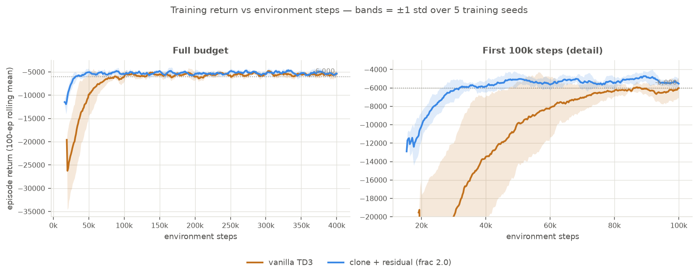

# 10. Vanilla RL — what the MPC prior actually buys

!!! note "Status: complete (2026-07-31)"
A **from-scratch TD3 agent** — no DeePC, no clone, same env, same reward — reaches
**0.992 ± 0.015** on the canonical 78-seed sweep against DeePC's **0.385**. It also
matches the clone+residual hybrid: on reach rate the two are **statistically
indistinguishable** (0.992 vs 0.997, overlapping CIs). So the MPC prior does **not**
raise the ceiling on this task. What it does buy is measurable and narrower:
**2.3× fewer environment steps** to a given return, a **~10× tighter spread across
training seeds**, a small but clean **return advantage** (complete rank separation,
$p = 0.0079$), and an exact **no-regression-at-init** guarantee. All numbers below are
over **5 training seeds per arm**, because the single-seed version of this result was
misleading — see "Why 5 seeds".

## Motivation (one line)

[08](08-residual-rl.md) showed a residual lifts DeePC's 38.5 % to 94.9 %. Missing control:
how much of that is the _residual_, and how much is just _RL on this task_?

## Context

Every arm so far shares DeePC's DNA — the clone imitates it, the residual corrects it. That
leaves the obvious question unanswered: on a 2-D kinematic unicycle with a dense shaped
reward and free simulation, does an agent need DeePC at all? Without that baseline, the
residual's 94.9 % has nothing to be measured against except the 38.5 % it improves on, which
flatters it.

This entry adds the control arm and reports what survives.

## Environment setup

The vanilla agent sees **exactly the env**, with no controller in the loop.

**Action space — DeePC's own bounds, in physical units.**

$$u = (v, w) \in [0, 20] \times [-\tfrac{\pi}{2}, \tfrac{\pi}{2}]$$

```
Box(low=[0.0, -1.5707964], high=[20.0, 1.5707964], shape=(2,), float32)
```

Read from `sample_bounds` in `data/libraries_v0.npz` via `canonical_action_bounds()` — the
same array handed to `DeePC(u_bounds=...)`, so the reachable command set is _identical_, not
merely similar. `v ≥ 0` means the robot may stall but never reverses.

There is deliberately **no `RescaleAction` wrapper**. SB3's off-policy algorithms already
normalize a non-symmetric `Box` internally (`policy.scale_action` / `unscale_action`) for the
actor head, the action noise and the replay buffer, so wrapping would add a second identical
affine map and hide `(v, w)` behind `Box(-1, 1)`. Two consequences worth knowing: the
exploration noise `σ = 0.1` lives in the _normalized_ frame, so per axis it is
$0.1 \times \tfrac{1}{2}(u_{\max}-u_{\min})$ — **±1.0 units/s on `v`, ±0.157 rad/s on `w`** —
and the replay buffer stores normalized actions, so a checkpoint is only meaningful in an env
with matching bounds.

**Observation space — the env's 5-D body-frame vector, min-max normalized.**

| idx | channel              | raw range      | normalization  |
| --- | -------------------- | -------------- | -------------- |
| 0   | `distance = ‖g − p‖` | `[0, 28.2843]` | `d/14.142 − 1` |
| 1   | `sin(bearing_rel)`   | `[-1, 1]`      | identity       |
| 2   | `cos(bearing_rel)`   | `[-1, 1]`      | identity       |
| 3   | `v_prev`             | `[0, 20]`      | `v/10 − 1`     |
| 4   | `w_prev`             | `[-π/2, π/2]`  | `w/(π/2)`      |

where `bearing_rel = wrap_to_pi(atan2(g_y − y, g_x − x) − δ)`. This is the same vector the
residual actor consumes, **minus its 2-D `u_base` block** — a from-scratch agent has no clone
to read a base action from. Normalization is `gymnasium.wrappers.RescaleObservation`, matching
the residual env's own min-max scheme, so the two policies are conditioned alike.

Three design points carried over from [02](02-env-design.md): the observation is **body-frame**
(no world `x, y, δ, g_x, g_y`), which makes the policy invariant to where in the workspace the
episode happens; headings are `(sin, cos)` rather than an angle, avoiding the `±π` wrap
discontinuity; and `v_prev, w_prev` expose the previous command.

**Reward — the env's native DeePC-form cost, unmodified.** Same `Q = diag(1,1,2)`,
`R = 1.3e-3 I`, `reach_bonus = 100`, `max_steps = 200`, `goal_tolerance = 0.5`.

!!! warning "The vanilla arm is formally a POMDP"
The reward's heading term is $Q_{22}\,\delta^2$ in **absolute world heading**, and `δ`
appears nowhere in the body-frame observation. Three states with byte-identical
observations produce three different rewards:

    ```
    δ=+0.000  obs=[5. 0. 1. 0. 0.]  reward=−25.0000   = 25 + 0
    δ=+1.571  obs=[5. 0. 1. 0. 0.]  reward=−29.9348   = 25 + 2(π/2)²
    δ=+3.142  obs=[5. 0. 1. 0. 0.]  reward=−44.7392   = 25 + 2π²
    ```

    Up to **19.7 reward per step** is unexplainable from the agent's view. It still learns
    the task — termination and the reach bonus are position-only, which *is* observable — but
    its value function cannot be exact. The residual arm is partly shielded from this: its
    `u_base` comes from the clone, whose features include `y_current = (x, y, sin δ, cos δ)`,
    so it has indirect access to `δ`. **The vanilla-vs-residual gap therefore mixes two
    effects: learning from scratch, and an observability difference.**

## Learning speed — the headline result



Environment steps for the 100-episode rolling-mean return to first clear **−6000**:

| arm                             | steps to −6000     | per training seed                           |
| ------------------------------- | ------------------ | ------------------------------------------- |
| vanilla TD3                     | 69,547 ± 24,348    | 85,593 / 105,517 / 49,423 / 69,402 / 37,800 |
| **clone + residual (frac 2.0)** | **30,816 ± 5,214** | 29,067 / 24,517 / 34,788 / 38,731 / 26,975  |

**2.3× on the means**, with complete rank separation — the residual's slowest seed (38,731)
still beats vanilla's fastest (37,800), so the exact two-sided Mann–Whitney test gives
$p = 0.0079$. The **variance ratio is 4.7×**: vanilla's time-to-threshold varies 2.8× on seed
alone (37.8k → 105.5k), the residual's 1.6×.

!!! warning "This is a better initialization, not a faster learner"
Read where the curves _start_. The residual's first plotted point is already near
**−12,000**; vanilla's is **−26,000** with its band reaching −35,000. That gap is
zero-init: at step 0 the residual _is_ the clone, a 38.5 %-reach policy, while vanilla is
random. Once vanilla passes the residual's _starting_ return around 30k steps, the two
curves rise at broadly similar rates and converge by ~90k. So the honest claim is "you
skip the first ~40k steps because you already own a controller," which is worth something
only when environment steps are expensive. In free simulation, 40k steps is ~2.5 minutes.

Also note these are _training_ returns, so they include exploration noise — the behaviour
policy, not the deployed one — and the −6000 threshold is arbitrary; the ratio moves if you
pick another level.

## Side-by-side — clone vs vanilla TD3

Same two canonical showcase seeds as [07](07-imitation-learning.md) and
[08](08-residual-rl.md), so the arms are directly comparable across entries. The clone stalls
in the far field; the from-scratch agent, which never saw DeePC, drives through and reaches.

<table>
<tr><th>Clone — the DeePC surrogate (stalls)</th><th>Vanilla TD3 — from scratch (reaches)</th></tr>
<tr><td colspan="2"><b>seed 4104626029</b></td></tr>
<tr>
<td colspan="2"><video controls loop muted playsinline width="560"><source src="../videos/clone-vs-vanilla-4104626029.mp4" type="video/mp4">Your browser does not support the video tag.</video></td>
</tr>
<tr><td colspan="2"><b>seed 4104626034</b></td></tr>
<tr>
<td colspan="2"><video controls loop muted playsinline width="560"><source src="../videos/clone-vs-vanilla-4104626034.mp4" type="video/mp4">Your browser does not support the video tag.</video></td>
</tr>
</table>

_Each panel: trajectory (trail, goal ★, tolerance circle, heading marker) plus live `v(t)`,
`w(t)` and cumulative-reward sparklines, real time at 40 fps. On seed 4104626029 the clone
truncates at step 200 with `v` decayed to ~1.0; vanilla reaches at step 116, cumulative
reward −23k vs the clone's −48k._

And the residual-vs-vanilla pairing on the four seeds where the `frac=1.0` residual failed:

<table>
<tr><th>clone + residual vs vanilla TD3 — seeds 4104626056 / 069 / 083 / 086</th></tr>
<tr><td><video controls loop muted playsinline width="560"><source src="../videos/residual-vs-vanilla-4104626083.mp4" type="video/mp4">Your browser does not support the video tag.</video></td></tr>
</table>

_Seed 4104626083 is the hardest in the sweep — the only seed any `frac=2.0` model fails, and
one of vanilla's three. The `frac=1.0` residual misses it by **0.022 units** (final distance
0.522 against a 0.5 tolerance)._

## Final performance — 5 training seeds × 78 eval seeds

| arm                              | reach per training seed | reach rate        | pooled (390 ep)        | return             |
| -------------------------------- | ----------------------- | ----------------- | ---------------------- | ------------------ |
| DeePC (QP)                       | — (deterministic)       | 30/78 = 0.385     | —                      | −13,799.6          |
| clone `f_θ`                      | — (deterministic)       | 30/78 = 0.385     | —                      | −14,355.6          |
| clone + residual, `frac=1.0`     | 74 73 70 76 69          | 0.928 ± 0.033     | 362/390 [0.898, 0.950] | −7,067.7 ± 102.7   |
| **clone + residual, `frac=2.0`** | 78 78 77 78 78          | **0.997 ± 0.005** | 389/390 [0.986, 1.000] | **−4,777.3 ± 7.3** |
| **vanilla TD3**                  | 78 78 78 78 **75**      | **0.992 ± 0.015** | 387/390 [0.978, 0.997] | −4,853.5 ± 77.1    |

What is and is not statistically supported (exact two-sided Mann–Whitney on 5 vs 5, so
$p = 0.0079$ is the floor for complete rank separation):

- **vanilla ≫ DeePC / clone** — decisive, no ambiguity.
- **`frac=2.0` > `frac=1.0` on reach** — complete rank separation, $p = 0.0079$,
  non-overlapping pooled CIs.
- **`frac=2.0` > vanilla on return** — complete rank separation, $p = 0.0079$. All five
  residual runs beat all five vanilla runs.
- **`frac=2.0` vs vanilla on reach — NOT separable.** 77–78 vs 75–78 overlap.

**The variance is the sharpest difference.** Return spread across training seeds:
`frac=2.0` **22**, vanilla **204**, `frac=1.0` **266**. The residual is roughly **10× more
reproducible**; the DeePC base anchors where training lands. For a controller you intend to
deploy, that consistency may matter more than a fractional reach-rate difference.

### Why 5 seeds

The first version of this experiment used one training seed and reported vanilla at
**78/78 = 100 %**. That was real for that checkpoint and **not a property of the method** —
training seed 4 gives 75/78. Every number on this page is over 5 seeds because of it. Do not
quote a single-seed reach rate for this project.

### `residual_frac` was the residual's real bottleneck

The `frac=1.0` default is _underpowered_, and this is a parameterization artifact rather than
a knowledge deficit. The composition centres authority on the base and then clips:

$$u = \operatorname{clip}(u_{\text{base}} + \rho \cdot \tfrac{1}{2}(u_{\max}-u_{\min}) \cdot a_{\text{res}})$$

On the seeds it fails, the clone's `u_base` for `v` sits near zero (29–48 % of steps at
_exactly_ 0), so the maximum `v` the residual can command averages **~11 of 20** and
**73–93 % of steps clip**. Worse, every `a_res ≤ 0` collapses to the same applied `v = 0` — a
**dead zone** the trained policy drifts into (mean `a_res` for `v` = **−0.53** on seed
4104626083). Setting `ρ = 2.0` restores the full range from a stalled base and recovers all
four failures, **gained 4 / lost 0**. The feared wider dead zone never materialized.

## Conclusions

1. **From-scratch TD3 solves what DeePC cannot** — 0.992 vs 0.385. DeePC's ceiling is its
   orientation-keyed local-linear libraries on a system that isn't globally
   Koopman-linearizable, not a limit of the task.
2. **The MPC prior does not raise the ceiling here.** Reach rate cannot distinguish vanilla
   from `frac=2.0`.
3. **What the prior does buy, measurably:** 2.3× fewer steps to a given return (mostly a
   better initialization), a ~10× tighter return spread across seeds, a clean return
   advantage ($p = 0.0079$), and an exact, unit-testable no-regression-at-init guarantee that
   vanilla cannot offer at any price. **Read the 2.3× as a training-return number only** — on
   deployed reach rate it is 1.33× and not separable ([10](10-sample-efficiency.md)); the
   variance half of this conclusion is what holds up.
4. **Reach rate hides real differences.** Per step, vanilla is the _worst_ arm on the two
   terms it isn't effectively supervised on — heading cost/step 6.64 vs `frac=2.0`'s 6.41 and
   `frac=1.0`'s 6.21, and control cost/step 0.127 vs 0.082 for `frac=1.0`. It wins per-episode
   totals by finishing in 68 steps instead of 163.
5. **Don't over-generalize from this benchmark.** It is close to the _least_ favourable test
   of RL + MPC: dense shaped reward, deterministic and fully observed plant, 2-D action, free
   unlimited simulation, no safety constraint binding during learning — precisely where
   end-to-end RL should win outright. And the prior being improved is a 38.5 % controller, so
   there is little knowledge to inherit. The method's premise is a _decent_ model-based
   controller you want to improve.

## Open / not yet reported

- **PPO on the vanilla arm.** The whole TD3-over-PPO argument is reasoning from properties,
  not measurement. The POMDP result gives PPO a principled shot.
- **Paper action bounds** (`v ∈ [10,20]`, `w ∈ [±π/6]`) — forward-only, 3× weaker turning.
  This is where end-to-end RL should struggle and the prior should matter; it needs a DeePC
  library re-collect under those bounds to be fair. **The strongest remaining test of
  conclusion 5.**
- **Heading-augmented vanilla observation.** Appending `(sin δ, cos δ)` would close the
  POMDP hole; does the per-step heading cost drop toward DeePC's?
- **Robustness to plant perturbation.** Wrappers exist (`two_wheel_robot/env/perturbations.py`:
  state disturbance, actuator-gain mismatch, control latency), but **no results are reported
  here** — the metric isn't settled yet. Two blockers: the frozen clone is a poor stand-in for
  DeePC on exactly this axis (DeePC re-solves its QP every step; the clone cannot), and at 5
  training seeds the per-model scatter swamps the between-arm differences.

## Reproduce

```bash
# train the from-scratch baseline (no DeePC, no clone; same reward and bounds)
uv run python scripts/train_vanilla.py --timesteps 400000 --seed 0 \
    --out data/vanilla_td3_400k.zip --monitor-out data/vanilla_400k_monitor

# four-way benchmark: DeePC (QP) vs clone vs clone+residual vs vanilla, 78 seeds
# (QP-bound: ~0.29 s per DeePC step, ~1 h for the sweep)
uv run python scripts/eval_residual.py --model data/residual_td3_400k_frac2.zip \
    --vanilla data/vanilla_td3_400k.zip

# the residual with full authority -- the frac=1.0 default is underpowered
uv run python scripts/train_residual.py --timesteps 400000 --residual-frac 2.0 \
    --out data/residual_td3_400k_frac2.zip --monitor-out data/residual_frac2_400k_monitor

# 5-seed sweep behind every number on this page (15 runs; ~25 min each, 6 in parallel)
for s in 0 1 2 3 4; do
  uv run python scripts/train_vanilla.py  --timesteps 400000 --seed $s \
      --out data/seedsweep/van_s$s.zip    --monitor-out data/seedsweep/van_s${s}_mon
  uv run python scripts/train_residual.py --timesteps 400000 --seed $s --residual-frac 2.0 \
      --out data/seedsweep/res_f2_s$s.zip --monitor-out data/seedsweep/res_f2_s${s}_mon
done

# learning-speed figure + steps-to-threshold table (reads the monitor CSVs above)
uv run python scripts/plot_learning_curves.py

# side-by-side videos: clone vs vanilla on the canonical showcase seeds
uv run python scripts/render_dashboard_video.py --compare clone-vanilla \
    --vanilla-model data/seedsweep/van_s0.zip --seeds 4104626029,4104626034
```
