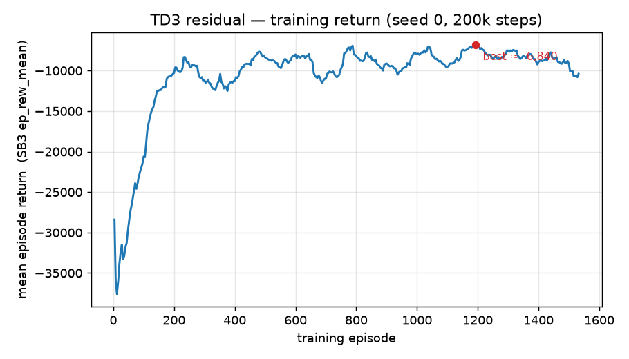
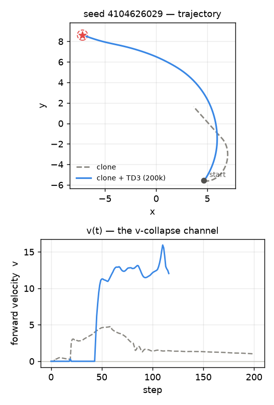
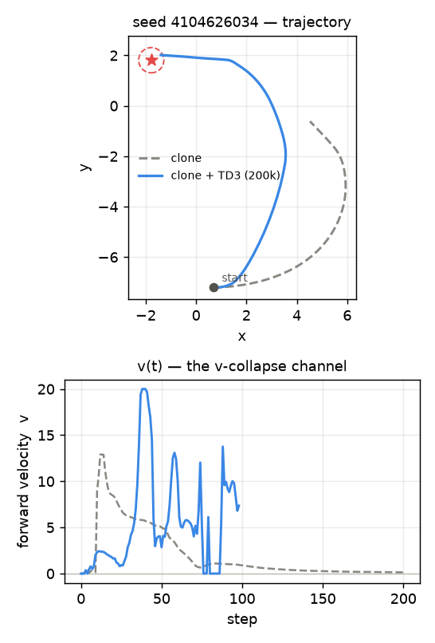
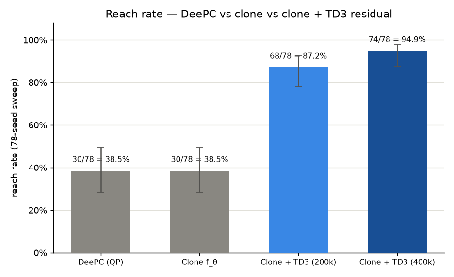
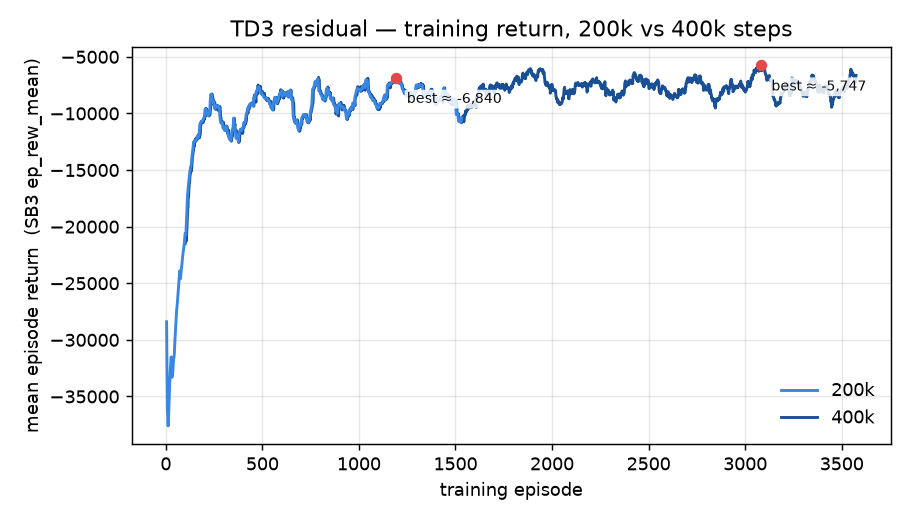

# 10. Residual RL — RL + MPC over the frozen clone

!!! note "Status: complete (2026-07-08; extended 2026-07-20)"
A **TD3 residual** trained on top of the frozen DeePC clone turns the far-field
`v`-collapse from a failure into a solve. On the canonical 78-seed sweep the hybrid
`u = clip(f_θ + μ)` reaches **68/78 = 87.2 %** vs the clone's (and DeePC's) **30/78 =
38.5 %** — it **rescues 38** of the 48 seeds the clone stalls on with **0 regressions**
(it never breaks a seed the clone already solved), McNemar $p < 10^{-4}$. The residual is
**zero-initialized**, so at step 0 it *is* the clone; RL only adds the forward velocity the
hallucinated predictor refused to. The QP never re-enters the loop: control is a **103 µs**
two-MLP forward pass. This is the paper's **RL + MPC** architecture
([arXiv:2510.03354](https://arxiv.org/abs/2510.03354), Eq. 18) on the unicycle task.
**2026-07-20 update:** doubling the training budget to 400k steps (same
hyperparameters, fresh zero-init run) lifts this to **74/78 = 94.9 %**, rescuing 6 of
the 10 remaining failures with still **0 regressions** — see the "Follow-up — training
to 400k steps" section below.

## Motivation (one line)

The clone faithfully reproduces DeePC — including its ~39 % ceiling and the far-field stall
([09](09-imitation-learning.md)). Add a learned residual that fixes the stall while keeping
everything DeePC already gets right.

## Context

[08](08-stop-at-goal.md) diagnosed the ceiling: DeePC navigates well on ~39 % of seeds and
**collapses** on the rest — a hallucinated-prediction `v`-collapse where the QP commits
`v ≈ 0` and the robot stalls in the far field. [09](09-imitation-learning.md) amortized DeePC
into a 23 µs neural clone `f_θ` that reproduces both its **successes and its failures** —
by design, so that a learned residual has a fast, faithful baseline to correct. This entry
is that residual.

The plan named the obstacle it removes:

> "Residual RL keeps the **QP in the training loop** — a ~0.5 s solve every step … likely
> prohibitive as-is."

Because the baseline is now `f_θ` (a forward pass), the QP never enters the RL loop.

## What was built

**The composition.** A standalone `gym.Env` (`ResidualDeePCEnv`) holds the frozen clone, an
inner `TwoWheelGoal-v0`, and the DeePC-style `T_ini` buffer. Each step it forms the paper's
RL + MPC control (Eq. 18):

$$u = \operatorname{clip}\!\big(\underbrace{f_\theta(\text{features})}_{\text{frozen clone}} + \underbrace{\rho \cdot \tfrac{1}{2}(u_{\max}-u_{\min})\cdot \mu(\text{obs}\mid\theta^\mu)}_{\text{learned residual}},\ u_{\min},\ u_{\max}\big)$$

and slides the buffer with `(applied u, pre-step y)` — the exact convention the clone was
labeled under, so the two stay comparable. The residual authority `ρ = residual_frac` defaults
to **1.0** (full range): the far-field fix needs a *large* `v` correction to escape the stall,
and the final `clip` keeps `u` in bounds regardless.

**Zero-init = no-regression at init.** The TD3 actor's output head is zero-initialized, so at
step 0 the residual is exactly 0 and the policy is **bit-for-bit identical to the clone**
(a unit-test pins this: a zero-residual rollout reproduces the clone's closed loop exactly).
RL can then only *add* to a known-good baseline — the floor is "no worse than clone."

**Observation / action.** The actor sees a 7-D obs — the env's body-frame state (5) plus the
baseline's proposed `u_base` (2), min-max normalized to $[-1,1]$ — and emits a residual in
$[-1,1]^2$. Feeding it `u_base` lets it learn *how much to correct the baseline* rather than
rediscovering the baseline.

**Why TD3 — not PPO or classic DDPG.** The earlier roadmap defaulted to **PPO**; the paper
uses **classic DDPG**; we use **TD3**. PPO is on-policy, so it discards the *rare* stall-escape
transitions this problem hinges on — an off-policy **replay buffer** reuses them — and its
stochastic policy has no clean "start exactly at the clone and stay there until it helps"
init. Classic DDPG is the right family (off-policy, deterministic actor — which is what makes
zero-init crisp) but is notoriously unstable; **TD3 is a strict, drop-in upgrade** (twin
critics + clipped double-Q against overestimation, target-policy smoothing, delayed actor
updates). SAC is kept as a built-in fallback (`--algo sac`) for the hard-exploration regime,
not the default.

**Training.** TD3 on the env's **native reward** (already DeePC's quadratic cost + reach
bonus), 200k steps, single env, `net_arch=[256,256]`, action-noise σ = 0.1, CPU. Mean episode
reward improved ~4× (−3.4·10⁴ → a noisy plateau around −8·10³; best −6.8·10³) as the residual
learned to drive through the stall (curve below). The QP is never called during training.



*Mean episode return (SB3 `ep_rew_mean`) over training episodes — the shipped seed-0 run: a
rapid climb (episodes ~20–200), then a noisy plateau (~−7k to −11k). The return plateaus and
even dips late while the **reach rate is 87.2 %** — the reward also charges control effort
`−uᵀRu`, so a lower return does not mean fewer reaches (TD3 also saves the final, not the best,
policy). Regenerate from the committed curve with `uv run python scripts/plot_training_return.py`.*

## Side-by-side — clone vs clone+residual

Two **rescued** seeds under the canonical config (same start/goal for both controllers). Left
= the clone (stalls in the far field); middle = clone + residual (reaches); right = the same
two closed loops as a static trajectory + `v(t)` trace, so the video's qualitative "it
drives through the stall" is paired with the quantitative channel that changed. These are the
`v`-collapse seeds from [08](08-stop-at-goal.md) — the exact regime the residual was built for.

<table>
<thead>
<tr><th>Clone — the DeePC surrogate (stalls)</th><th>Clone + TD3 residual (reaches)</th><th>Trajectory + v(t)</th></tr>
</thead>
<tbody>
<tr><td colspan="3" align="center"><b>seed 4104626029</b> — clone truncates at <b>12.91</b> (deep far-field stall); residual REACHES in <b>116 steps</b> → 0.39</td></tr>
<tr>
<td><video controls loop muted playsinline width="280"><source src="videos/clone-4104626029.mp4" type="video/mp4">Your browser does not support the video tag.</video></td>
<td><video controls loop muted playsinline width="280"><source src="videos/residual-4104626029.mp4" type="video/mp4">Your browser does not support the video tag.</video></td>
<td></td>
</tr>
<tr><td colspan="3" align="center"><b>seed 4104626034</b> — clone truncates at <b>6.75</b>; residual REACHES in <b>98 steps</b> → 0.43</td></tr>
<tr>
<td><video controls loop muted playsinline width="280"><source src="videos/clone-4104626034.mp4" type="video/mp4">Your browser does not support the video tag.</video></td>
<td><video controls loop muted playsinline width="280"><source src="videos/residual-4104626034.mp4" type="video/mp4">Your browser does not support the video tag.</video></td>
<td></td>
</tr>
</tbody>
</table>

*Trajectory panel: clone (dashed gray, stalls) vs clone + TD3 residual (blue, reaches), goal
marked with a star and the 0.5-unit tolerance circle. `v(t)` panel: the same two closed loops'
forward-velocity channel — the clone's `v` decays toward 0 (the collapse), the residual's `v`
climbs instead of decaying and drives the reach. Regenerate with
`uv run python scripts/plot_seed_traces.py --seed 4104626029` (reads the committed
`traj_<seed>_{clone,residual}.csv`, written once by `scripts/eval_seed_showcase.py`).*

## Metrics

### Three-way reach rate — 78 seeds, base seed `4104626029`, canonical config

| controller                | reach rate           | 95 % CI (Wilson) | per-step control |
| ------------------------- | -------------------- | ---------------- | ---------------- |
| DeePC (QP)                | 30 / 78 = **38.5 %** | [0.284, 0.496]   | ~0.6 s (QP)      |
| clone `f_θ` (surrogate)   | 30 / 78 = **38.5 %** | [0.284, 0.496]   | 23 µs (MLP)      |
| **clone + TD3 residual**  | 68 / 78 = **87.2 %** | [0.780, 0.929]   | **103 µs** (2 MLPs) |
| **clone + TD3 residual (400k)** | 74 / 78 = **94.9 %** | [0.875, 0.980] | **103 µs** (2 MLPs) |

DeePC and the clone match at 30/78 — the clone reproduces the QP baseline exactly, confirming
the harness is identical to [09](09-imitation-learning.md).



*Reach rate over the canonical 78-seed sweep, error bars = 95 % Wilson CI. DeePC and the
clone are statistically indistinguishable (by construction); the residual is a clear jump
outside either baseline's CI, and doubling the training budget lifts it further still.
Regenerate with `uv run python scripts/plot_reach_rates.py` (reads the committed
`docs/journey/figures/reach_rates.csv` — no benchmark re-run needed).*

### Paired — residual vs clone (the decisive test)

| paired metric                                          | value                              |
| ------------------------------------------------------ | ---------------------------------- |
| confusion (both / clone-only / residual-only / neither) | **30 / 0 / 38 / 10**              |
| **rescued** (clone fails → residual reaches)           | **38**                             |
| **regressions** (clone reaches → residual fails)       | **0**                              |
| McNemar $p$                                             | **$< 10^{-4}$** (highly significant, one-sided improvement) |
| trajectory position deviation vs clone                 | median **2.45** · median-of-p95 **5.90** (units) |

## Reading the numbers

- **It fixes the failure regime, not a random slice.** The 38 rescued seeds are exactly the
  far-field `v`-collapse cases from [08](08-stop-at-goal.md). Reach rate goes 38.5 % → 87.2 %
  by solving the hard 62 %, not by trading one set of seeds for another.
- **Zero regressions — the no-regression property held through training.** Every seed the
  clone solved, the residual still solves (clone-only = 0). Zero-init guaranteed this at step
  0; 200k steps of TD3 never gave it back. This is the payoff of adding a residual *on top of*
  a good baseline rather than fine-tuning away from it.
- **Larger trajectory deviation is the point here.** Unlike the clone (which was built to
  *track* DeePC, ~0.9-unit deviation in [09](09-imitation-learning.md)), the residual is built
  to *diverge* where DeePC stalls — hence median 2.45 units. The deviation concentrates on the
  rescued seeds, where the clone sits still and the residual drives to the goal.
- **The 10 that remain.** 10/78 are solved by none of the three — the residual is a large
  improvement, not a universal solver. These are the next frontier.
- **The speedup survives.** Control is a 103 µs two-MLP forward pass (clone `f_θ` + actor μ)
  vs the QP's ~0.6 s — ~5,800× — and the QP never entered the training loop.

## What this shows

The paper's **RL + MPC** hybrid transfers to the unicycle: an amortized MPC surrogate supplies
the prior where its data representation is valid, and a conservatively-initialized RL residual
backstops the regime where it is not — recovering more than half the task's failures at no cost
to its successes and no QP in the loop.

Open questions carried forward:

- Does residual RL beat the much cheaper `--Q_heading 0` / `--no_bearing_ref` heading-reference
  fix floated in [08](08-stop-at-goal.md)? (Direct A/B still open.)
- The 10 unsolved seeds — geometry-hard, or reachable with more training / SAC's stronger
  exploration (`--algo sac`)? **Partially answered below: more training alone rescues 6 of the
  10; the remaining 4 look structural, not just undertrained.**

## Follow-up — training to 400k steps (2026-07-20)

The first open question above ("reachable with more training?") is cheap to test directly:
same architecture, same hyperparameters (`net_arch=[256,256]`, action-noise σ = 0.1, seed 0),
just `--timesteps 400000` instead of `200000` — a fresh zero-init run, not a continuation of
the shipped checkpoint. `ep_rew_mean` plateaus at a similar level to the 200k run (~−6.8·10³
to −6.9·10³), so the aggregate training curve doesn't obviously look "still climbing" — the
gain comes from continued fine convergence on the hard seeds, not an unfinished run.



*Mean episode return (SB3 `ep_rew_mean`) for both runs on the same axes. The two curves are
close to indistinguishable up to ~episode 1,300 (same seed, same hyperparameters — only the
horizon differs), then visibly diverge before the 200k run ends at ~episode 1,550: the 400k
run is not simply "the 200k run, continued," it's a fresh zero-init run whose noisy plateau
happens to sit at a similar level, consistent with the reach-rate gain coming from convergence
on individual hard seeds rather than a still-rising aggregate curve. Regenerate with
`uv run python scripts/plot_training_return.py --compare 200k:docs/journey/figures/residual_return.csv
400k:docs/journey/figures/residual_return_400k.csv` (both curve CSVs are committed data).*

Reach rate for both checkpoints is already in the [Three-way reach rate table](#three-way-reach-rate-78-seeds-base-seed-4104626029-canonical-config)
above (68/78 → 74/78). Of the 10 seeds that failed at 200k, **6 are fixed** by the longer run
(`4104626037, 59, 64, 81, 90, 92`) — lifting rescued from 38 to **44** — and **4 still fail**
(`4104626056, 69, 83, 86`) — confirmed with **0 newly-introduced regressions**: every seed the
200k model solved, the 400k model still solves.

**The 4 that remain, re-examined:**

- **Seed `4104626056` — wide fly-by, unchanged.** Sweeps in on one big curved arc (turns a
  single direction the whole episode) that passes the goal at ~1.9 units and swings back out
  without ever tightening into a spiral. Essentially the same shape as at 200k.
- **Seed `4104626069` — crawl-and-drift.** Approaches to 1.70 units by step 100, then drifts
  back out to 2.49 by the end while still turning near max rate — no longer a clean stall
  (`v` doesn't fully collapse to 0 the way it did at 200k) but still doesn't converge.
- **Seed `4104626083` — hairline near-miss, most encouraging.** This was a **complete freeze**
  at 200k (`v≈0`, `w≈0` for nearly the whole episode). At 400k it drives hard the entire way
  and is still accelerating (`v = 5.19`) when the 200-step cap hits at `dist = 0.52` — 0.02
  units outside the 0.5 tolerance. This looks like it would reach with only a handful more
  steps; the freeze is gone.
- **Seed `4104626086` — traded one failure mode for another.** At 200k this was a near-miss
  stop-and-spin (closest approach 0.64). At 400k the closest approach is actually **worse**
  (1.37) — it now overshoots in a fast pass, loops back for a correction, and runs out of
  steps mid-correction. Still a failure either way (so it doesn't count against the
  0-regressions claim, which is measured on reach/no-reach), but it's a reminder that TD3
  training isn't monotonically improving every seed's trajectory quality even as the aggregate
  reach rate goes up.

<figure markdown>
  <video controls loop muted playsinline width="480">
    <source src="videos/residual-400k-fail-4104626056.mp4" type="video/mp4">
    Your browser does not support the video tag.
  </video>
  <figcaption>
    Seed 4104626056 (400k model) — wide fly-by that never tightens into the goal
    (final_dist 1.94).
  </figcaption>
</figure>

<figure markdown>
  <video controls loop muted playsinline width="480">
    <source src="videos/residual-400k-fail-4104626069.mp4" type="video/mp4">
    Your browser does not support the video tag.
  </video>
  <figcaption>
    Seed 4104626069 (400k model) — approaches then drifts back out (final_dist 2.49).
  </figcaption>
</figure>

<figure markdown>
  <video controls loop muted playsinline width="480">
    <source src="videos/residual-400k-fail-4104626083.mp4" type="video/mp4">
    Your browser does not support the video tag.
  </video>
  <figcaption>
    Seed 4104626083 (400k model) — hairline near-miss (final_dist 0.52 vs 0.5 tolerance),
    still driving hard (`v = 5.19`) when the step cap hits. No longer the complete freeze
    seen at 200k.
  </figcaption>
</figure>

<figure markdown>
  <video controls loop muted playsinline width="480">
    <source src="videos/residual-400k-fail-4104626086.mp4" type="video/mp4">
    Your browser does not support the video tag.
  </video>
  <figcaption>
    Seed 4104626086 (400k model) — fast overshoot and a correction loop that doesn't
    complete in time (final_dist 1.37, worse closest-approach than at 200k).
  </figcaption>
</figure>

**Reading it:** more training is a real, cheap lever (+7.7 points, 0 regressions) and it
disproportionately helps the near-miss/late-overshoot population identified from the 200k
failure videos — but two of the four remaining failures (`56` wide-orbit, `69` crawl-and-drift)
look geometry/control-authority limited rather than undertrained, consistent with the
velocity-decay-near-goal and reward-shaping ideas floated as next steps. Seed `83` is the
exception — it looks like pure undertraining and may well flip with even more steps.

## Reproduce

```bash
# train the TD3 residual over the frozen clone (native env reward; QP never in the loop)
uv run python scripts/train_residual.py --timesteps 200000 --out data/residual_td3.zip

# three-way benchmark: DeePC (QP) vs clone-only vs clone+residual on the 78-seed sweep
uv run python scripts/eval_residual.py --model data/residual_td3.zip \
    --n_seeds 78 --base_seed 4104626029

# side-by-side videos on a rescued seed (clone stalls, residual reaches)
uv run python scripts/run_clone.py    --record docs/journey/videos --seeds 4104626029  # -> episode_<seed>.mp4
uv run python scripts/run_residual.py --record docs/journey/videos --seeds 4104626029  # -> episode_<seed>.mp4

# regenerate the training-return figure from the committed curve CSV
uv run python scripts/plot_training_return.py
# ...or from a fresh run's raw returns:
#   uv run python scripts/train_residual.py --monitor-out data/residual_monitor ...
#   uv run python scripts/plot_training_return.py --monitor data/residual_monitor.monitor.csv

# regenerate the reach-rate bar chart from the committed benchmark-results CSV
# (no 78-seed re-run needed -- it's QP-bound and takes minutes per seed)
uv run python scripts/plot_reach_rates.py

# --- 2026-07-20 follow-up: 400k-step run ---
uv run python scripts/train_residual.py --timesteps 400000 --out data/residual_td3_400k.zip \
    --monitor-out data/residual_400k_monitor

uv run python scripts/eval_residual.py --model data/residual_td3_400k.zip \
    --n_seeds 78 --base_seed 4104626029

# failure videos for the 4 seeds still unsolved at 400k
uv run python scripts/run_residual.py --model data/residual_td3_400k.zip \
    --record docs/journey/videos \
    --seeds 4104626056,4104626069,4104626083,4104626086  # -> episode_<seed>.mp4

# regenerate the 200k-vs-400k training-return overlay from the committed curve CSVs
# (the 400k curve CSV was derived once via:
#   uv run python scripts/plot_training_return.py --monitor data/residual_400k_monitor.monitor.csv \
#       --out docs/journey/figures/residual_return_400k.png \
#       --save-curve docs/journey/figures/residual_return_400k.csv )
uv run python scripts/plot_training_return.py --compare \
    200k:docs/journey/figures/residual_return.csv \
    400k:docs/journey/figures/residual_return_400k.csv \
    --out docs/journey/figures/residual_return_comparison.png

# --- per-seed showcase data (video-matched trajectory + v(t) traces) ---
# generates traj_<seed>_{clone,residual}.csv; DeePC is skipped entirely
# (clone/residual only), so this runs in seconds, not the QP-bound
# minutes-per-seed of eval_residual.py's three-way benchmark
uv run python scripts/eval_seed_showcase.py

# trajectory + v(t) companion figure for a video-showcased seed (200k, to match
# the embedded video's checkpoint)
uv run python scripts/plot_seed_traces.py --seed 4104626029
uv run python scripts/plot_seed_traces.py --seed 4104626034
```
