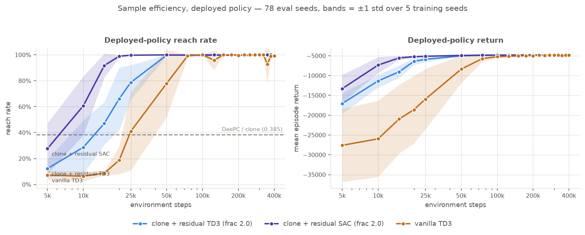
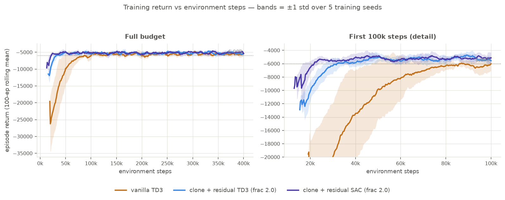

# 11. Sample efficiency on the deployed policy — and SAC

!!! note "Status: complete (2026-07-31)"

[10](09-vanilla-rl.md) claimed the MPC prior buys **2.3× fewer environment steps**, measured on
training _return_, and listed the cleaner version as an open item: reach rate at intermediate
checkpoints. Measured that way, **the 2.3× does not reproduce** — the residual reaches ≥ 95 %
in 44k ± 12k steps against vanilla's 60k ± 12k, a 1.33× ratio that does not clear significance
($p = 0.22$). Two things do survive. First, **vanilla's deployed reach rate never stops
wandering**: across every checkpoint past 100k its worst is **0.641**, against 0.987 for the
residual. Second, swapping the residual's optimizer to **SAC** reaches ≥ 95 % in
**17k ± 2.4k steps** — 2.6× faster than the TD3 residual ($p = 0.0159$) and 3.5× faster than
vanilla ($p = 0.0079$) — while landing on the identical asymptote. On this task **the
algorithm choice buys more sample efficiency than the MPC prior does.**

## Motivation

The [10](09-vanilla-rl.md) headline is a *behaviour-policy* number. A training-return curve
includes exploration noise and scores whatever start states training happened to sample; it
also depends on an arbitrary threshold (−6000) whose choice moves the ratio. None of that is
what you deploy. The deployed quantity is the greedy policy on the canonical 78-seed sweep,
and it can be measured at any checkpoint — so measure it.

The second question came for free once checkpointing existed: entry [09](08-residual-rl.md)
picked TD3 for the residual by reasoning from properties, never by measurement. SAC was
already implemented as the fallback path. Running it costs one training sweep.

## Method

Both existing arms retrained from scratch, 5 training seeds × 400k steps, snapshotting the
policy every 25k (`--checkpoint-dir`), then every snapshot evaluated **greedy** on the same 78
eval seeds every other entry uses. SAC added as a third arm on identical settings —
`residual_frac 2.0`, `lr 1e-3`, 5 seeds, 400k. That learning rate is the repo's CLI default
and matches the TD3 arms; it is *not* SB3's SAC default of 3e-4. Parity with the arm under
comparison was worth more than SAC's tuned default, for the same reason [10](09-vanilla-rl.md)
forced TD3 on its control arm.

Two checks before any of the numbers below mean anything:

- **The retrain reproduces the published table exactly** — at 400k, residual `78 78 77 78 78`
  and vanilla `78 78 78 78 75`, the same per-seed counts entry [10](09-vanilla-rl.md) reports.
  Training is seed-deterministic on this machine, so the intermediate checkpoints sit on the
  same runs as the already-published endpoints rather than on a parallel universe.
- **The first grid censored the answer.** SAC was already ≥ 95 % at 25k, the earliest
  checkpoint, on all 5 seeds — so its crossing point was unmeasurable. The early window was
  re-trained at 5k resolution (25k steps is ~90 s per run) and those runs reproduce the
  coarse ones exactly at their shared 25k point.

The lesson generalizes: **pick the checkpoint grid before claiming a crossing point.** A
25k-spaced grid cannot measure a 17k crossing.

## Reach rate vs training steps



| env steps | clone + residual **SAC** | clone + residual TD3 | vanilla TD3 |
| --------- | ------------------------ | -------------------- | --------------- |
| 5k        | 0.277 ± 0.196            | 0.123 ± 0.068        | 0.072 ± 0.036   |
| 10k       | 0.608 ± 0.227            | 0.287 ± 0.208        | 0.064 ± 0.038   |
| 15k       | **0.918 ± 0.093**        | 0.472 ± 0.164        | 0.087 ± 0.017   |
| 20k       | **0.990 ± 0.010**        | 0.662 ± 0.243        | 0.187 ± 0.108   |
| 25k       | 0.997 ± 0.005            | 0.787 ± 0.133        | 0.410 ± 0.302   |
| 50k       | 1.000 ± 0.000            | 0.997 ± 0.005        | 0.779 ± 0.260   |
| 100k      | 1.000 ± 0.000            | 0.995 ± 0.006        | 1.000 ± 0.000   |
| 200k      | 1.000 ± 0.000            | 1.000 ± 0.000        | 0.995 ± 0.006   |
| 350k      | 1.000 ± 0.000            | 0.997 ± 0.005        | **0.928 ± 0.144** |
| 400k      | 0.997 ± 0.005            | 0.997 ± 0.005        | 0.992 ± 0.015   |

Environment steps to the first checkpoint clearing a reach threshold (exact two-sided
Mann–Whitney on 5 vs 5, so $p = 0.0079$ is the floor):

| threshold | residual SAC       | residual TD3   | vanilla TD3    |
| --------- | ------------------ | -------------- | -------------- |
| ≥ 0.95    | **17,000 ± 2,449** | 44,000 ± 12,000 | 60,000 ± 12,247 |
| ≥ 0.99    | **27,000 ± 12,083** | 55,000 ± 10,000 | 75,000 ± 22,361 |

| pair | $p$ at ≥ 0.95 | $p$ at ≥ 0.99 |
| ---- | ------------- | ------------- |
| SAC residual vs vanilla | **0.0079** | 0.0159 |
| SAC residual vs TD3 residual | **0.0159** | 0.0317 |
| TD3 residual vs vanilla | 0.2222 | 0.3095 |

**The prior's advantage does not survive the change of metric; the optimizer's does.** The row
that matters is the last one: on the metric entry [10](09-vanilla-rl.md) built its headline
from, TD3-residual-over-vanilla is 1.33× and not separable, while SAC-over-TD3-residual is
2.6× and is.

!!! warning "Why the return metric gave a bigger number"
    Reach rate saturates. Every arm is pinned at ~1.0 from 100k onward, so the metric stops
    discriminating early and compresses the ratio; return keeps separating long after. Neither
    is wrong — they answer different questions. Reach rate answers "when is it deployable",
    return answers "when is it good", and only the first has a natural threshold.

The training-return view, with SAC added, agrees on the ordering and reproduces
[10](09-vanilla-rl.md)'s two published numbers exactly:



| arm | steps to 100-ep rolling return > −6000 |
| --- | -------------------------------------- |
| vanilla TD3 | 69,547 ± 24,348 |
| clone + residual TD3 (frac 2.0) | 30,816 ± 5,214 |
| **clone + residual SAC (frac 2.0)** | **20,340 ± 2,464** |

## Vanilla's instability is the real difference

Reporting one final checkpoint hides this. Over **every** checkpoint from 100k on
(5 seeds × 13 checkpoints = 65 evaluations per arm):

| arm | mean | worst single checkpoint | std |
| --- | ---- | ----------------------- | --- |
| clone + residual SAC | 0.9988 | 0.974 | 0.0043 |
| clone + residual TD3 | 0.9974 | 0.987 | 0.0051 |
| vanilla TD3 | 0.9895 | **0.641** (seed 3 @ 350k) | 0.0501 |

Both residuals stay inside a percentage point of solved for the entire back half of training.
Vanilla drops to 50/78 at 350k and 63/78 at 125k, then recovers. **So vanilla's published
0.992 is partly a lucky draw of where training stopped** — those same five runs, evaluated at
350k instead, average 0.928. This is the reach-rate form of the ~10× return-spread result in
[10](09-vanilla-rl.md), and it is the strongest argument in this project for putting a
controller underneath the policy: not a better ceiling, a floor you can trust.

The honest counter-reading: nobody deploys a random checkpoint. If your protocol is "train
400k, ship the last one," vanilla is fine here. The instability matters when the budget is
uncertain or early stopping is on the table.

## Final performance — every method, same 78 seeds

RL arms are 5 training seeds × 78 eval seeds = 390 episodes; the classical arms are
deterministic, so they get one 78-episode pass.

| method | reach per training seed | success rate | Wilson 95% |
| ------ | ----------------------- | ------------ | ---------- |
| DeePC (QP) | deterministic | 30/78 = 0.385 | 0.284–0.496 |
| clone `f_θ` | deterministic | 30/78 = 0.385 | 0.284–0.496 |
| clone + residual TD3, `frac=1.0` | 74 73 70 76 69 | 362/390 = 0.928 | 0.898–0.950 |
| clone + residual TD3, `frac=2.0` | 78 78 77 78 78 | **389/390 = 0.997** | 0.986–1.000 |
| clone + residual **SAC**, `frac=2.0` | 78 78 78 77 78 | **389/390 = 0.997** | 0.986–1.000 |
| vanilla TD3 | 78 78 78 78 75 | 387/390 = 0.992 | 0.978–0.997 |

The clone and the `frac=1.0` arm were re-measured for this entry and reproduce their published
counts exactly. DeePC's 30/78 is carried over from [10](09-vanilla-rl.md) — it is deterministic
and a re-run is ~1 h of QP solves.

**No pair among the top three is separable on reach.** McNemar on the 390 paired episodes:

| pair | discordant | $p$ |
| ---- | ---------- | --- |
| residual TD3 vs residual SAC | 1 / 1 | 1.0000 |
| residual TD3 vs vanilla | 3 / 1 | 0.6171 |
| residual SAC vs vanilla | 3 / 1 | 0.6171 |

Per-step cost tells the story reach rate cannot. Costs below are per-episode means divided by
mean episode length, because episode lengths differ across arms and per-episode sums hide it:

| arm | return (mean ± std over seeds) | steps | pos/step | head/step | ctrl/step | traj dev vs clone |
| --- | ------------------------------ | ----- | -------- | --------- | --------- | ----------------- |
| clone + residual TD3 | −4778.3 ± 7.9 | 72.6 | 60.6 | 6.42 | 0.144 | 3.77 |
| clone + residual SAC | **−4773.2 ± 15.3** | 73.0 | 60.3 | **6.37** | 0.134 | 3.92 |
| vanilla TD3 | −4854.7 ± 76.0 | 76.5 | **58.0** | 6.64 | **0.126** | 4.10 |

Mann–Whitney on the per-seed returns: both residuals beat vanilla at $p = 0.0079$ (complete
rank separation); **SAC vs TD3 is indistinguishable**, $p = 0.6905$. SAC's seed spread (15.3)
is double TD3's (7.9) but still 5× tighter than vanilla's (76.0).

Conclusion 4 of [10](09-vanilla-rl.md) holds with the third arm added: vanilla is worst on
heading cost per step — the term its body-frame observation cannot see — while being best on
position and control cost per step.

## Watching it learn

Side-by-side dashboards at each checkpoint, same two showcase seeds. Seed 4104626050 is the
clean illustration: the residual solves it early, vanilla drives into the workspace wall and
truncates until 100k.

<table>
<tr><th>SAC residual vs vanilla TD3 — 15k steps, seed 4104626050</th></tr>
<tr><td><video controls loop muted playsinline width="620"><source src="../videos/ckpt-sac-015k-4104626050.mp4" type="video/mp4">Your browser does not support the video tag.</video></td></tr>
<tr><th>TD3 residual vs vanilla TD3 — 25k steps, seed 4104626050</th></tr>
<tr><td><video controls loop muted playsinline width="620"><source src="../videos/ckpt-025k-4104626050.mp4" type="video/mp4">Your browser does not support the video tag.</video></td></tr>
<tr><th>TD3 residual vs vanilla TD3 — 100k steps, seed 4104626050 (both converged)</th></tr>
<tr><td><video controls loop muted playsinline width="620"><source src="../videos/ckpt-100k-4104626050.mp4" type="video/mp4">Your browser does not support the video tag.</video></td></tr>
</table>

_At 15k the SAC residual reaches in 35 steps while vanilla is still circling at step 200. By
100k both reach and the two trajectories are nearly the same curve — 42 steps vs 33 — which is
the asymptote result in visual form._

The full set is `docs/journey/videos/ckpt-{025,050,100,200,400}k-<seed>.mp4` (TD3 residual vs
vanilla) and `ckpt-sac-{015,025,050,100,200,400}k-<seed>.mp4` (SAC residual vs vanilla), for
seeds 4104626034 and 4104626050.

## Conclusions

1. **The 2.3× sample-efficiency claim is metric-dependent.** On deployed reach rate the same
   comparison is 1.33× and not statistically separable. [10](09-vanilla-rl.md)'s conclusion 3
   should be read as "2.3× on training return", not as a property of the method.
2. **SAC is the better optimizer for this residual, by a lot, on speed only.** 2.6× fewer steps
   to a deployable policy than TD3, with a 5× tighter spread across seeds — and an identical
   asymptote on reach, return, and cost split. TD3's zero-init argument from
   [09](08-residual-rl.md) survives the switch: SAC's mean head zeroes the same way and its
   deterministic evaluation returns `tanh(0) = 0`, so the no-regression-at-init guarantee is
   intact.
3. **The prior buys a floor, not a ceiling or (on this metric) speed.** Its measurable benefit
   is that reach rate never degrades mid-training and return spread across seeds stays ~10×
   tighter. On a task this easy that is the whole of it.
4. **Saturating metrics compress differences.** Reach rate is at ~1.0 from 100k for every arm,
   so it cannot rank them; per-step heading and control cost still can. Report both.
5. **Grid resolution is a measurement decision, not a detail.** The first sweep reported SAC's
   crossing as "≤ 25k" because 25k was the first checkpoint. The real answer, 17k, needed a
   grid five times finer.

## Open / not yet reported

- **SAC on the vanilla arm.** Every claim here about SAC is about SAC *as a residual*. If SAC's
  advantage is really about the optimizer rather than the composition, it should speed up the
  from-scratch arm too — and if it closes vanilla's gap entirely, conclusion 3 weakens further.
  This is the obvious next run and it is cheap.
- **SAC at its own default `lr`.** 1e-3 was chosen for parity with TD3, not because it is good
  for SAC. 3e-4 might be faster still, or more stable on the seed that lags.
- **Why vanilla degrades mid-training.** The 350k collapse on seed 3 is diagnosed only as "it
  happens". Whether it is critic divergence, a policy-noise interaction, or replay staleness is
  unexamined.
- **Robustness to plant perturbation** remains the open item [10](09-vanilla-rl.md) lists.

## Reproduce

```bash
# checkpoints every 25k over the full budget, per arm, per seed
uv run python scripts/train_residual.py --residual-frac 2.0 --timesteps 400000 --seed 0 \
    --out data/ckptsweep/res_s0.zip --checkpoint-dir data/ckptsweep/res_s0 --checkpoint-freq 25000
uv run python scripts/train_vanilla.py --timesteps 400000 --seed 0 \
    --out data/ckptsweep/van_s0.zip --checkpoint-dir data/ckptsweep/van_s0 --checkpoint-freq 25000
uv run python scripts/train_residual.py --algo sac --residual-frac 2.0 --timesteps 400000 --seed 0 \
    --out data/sacsweep/res_s0.zip --checkpoint-dir data/sacsweep/res_s0 --checkpoint-freq 25000 \
    --monitor-out data/sacsweep/res_s0_mon

# the 5k-resolution early window (25k budget, same seeds) -- needed for SAC's crossing point
uv run python scripts/train_residual.py --algo sac --residual-frac 2.0 --timesteps 25000 --seed 0 \
    --out data/earlysweep_sac/res_s0.zip --checkpoint-dir data/earlysweep_sac/res_s0 --checkpoint-freq 5000

# greedy evaluation of every checkpoint on the canonical 78 eval seeds
uv run python scripts/sweep_checkpoints.py --ckpt-root data/ckptsweep --out data/checkpoint_sweep.csv
uv run python scripts/sweep_checkpoints.py --ckpt-root data/sacsweep --arms residual \
    --algo sac --label residual_sac --out data/checkpoint_sweep_sac.csv

# figures (the plot script merges comma-separated CSVs)
uv run python scripts/plot_checkpoint_sweep.py --csv data/checkpoint_sweep_all.csv
uv run python scripts/plot_learning_curves.py --glob-sac 'data/sacsweep/res_s*_mon.monitor.csv' \
    --out docs/journey/figures/learning_curves_3arm.png

# checkpoint videos (--algo and --vanilla-algo are independent, so the columns can differ)
uv run python scripts/render_dashboard_video.py --seeds 4104626050 --compare residual-vanilla \
    --residual-frac 2.0 --algo sac --vanilla-algo td3 \
    --residual-model data/earlysweep_sac/res_s0/ckpt_15000_steps.zip \
    --vanilla-model data/earlysweep/van_s0/ckpt_15000_steps.zip \
    --figdir data/ckptvideo_sac/15000 --video-prefix ckpt-sac-015k \
    --title-note "  —  SAC residual, 15k training steps"
```
