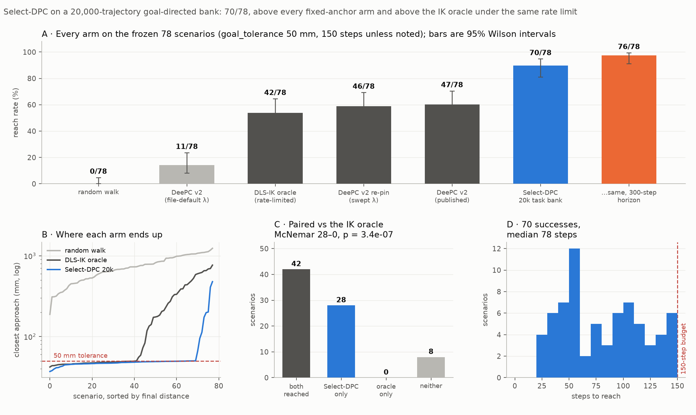
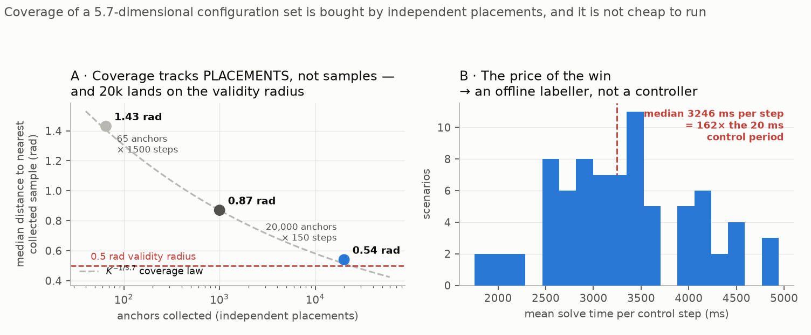
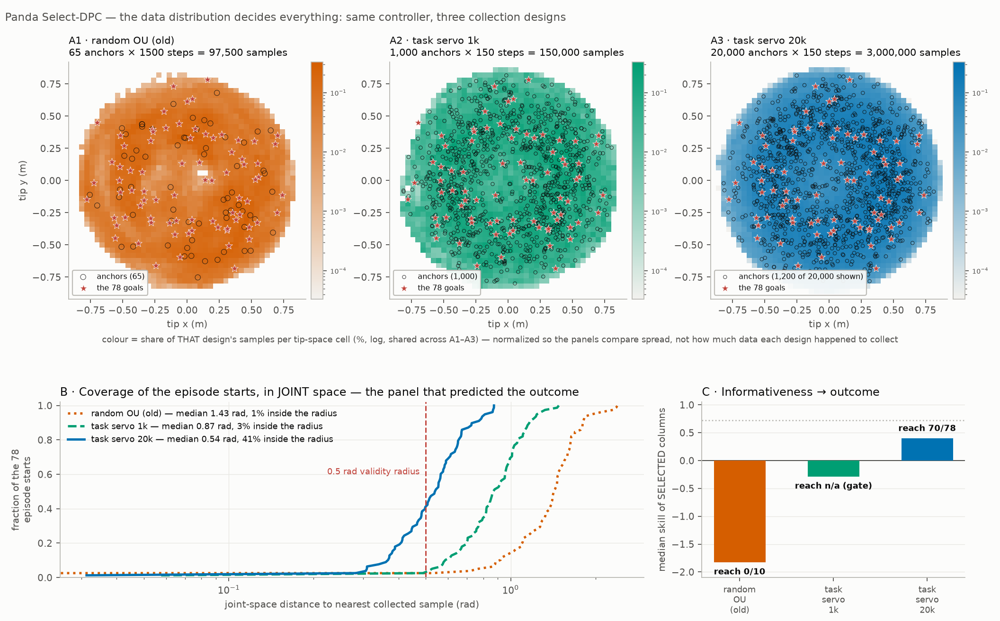
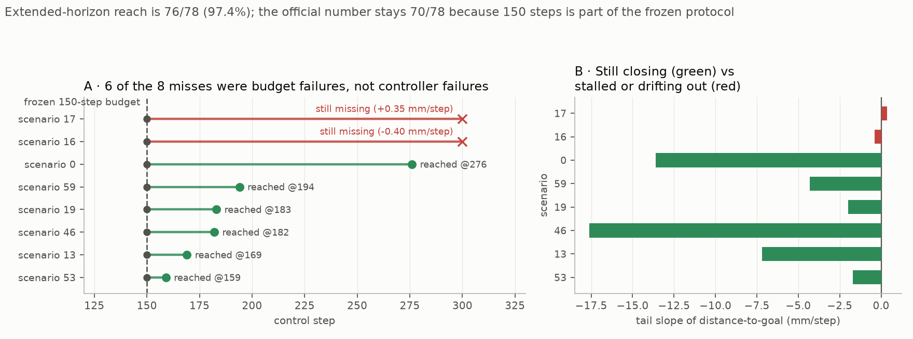

# 15. The Panda task bank — the data was the controller all along

## Decision

Replace the Panda expert's data, not its controller. A **20,000-trajectory
goal-directed bank** fed to Select-DPC reaches **70/78 (89.7%)** on the frozen
scenarios, against 47/78 for the published fixed-anchor DeePC and 0/10 for the
identical Select-DPC on the old random-excitation bank. The lever was collection
design; every controller knob was left at its default. Frozen as
**`panda_expert_v1`** (`data/panda_expert_v1.md`).

The one-line version of panel A: the same algorithm that scored **0/10** on
randomly-excited data scores **70/78** on goal-directed data. Nothing about
Select-DPC changed between those two numbers.

## Context

Two prior entries set this up and both pointed the same way.
[11](11-panda-anchors.md) measured Panda libraries as excellent within ~0.5 rad
of their anchor and *anti-informative* beyond ~2 rad, with a typical episode
start sitting 1.98 rad from the nearest anchor — the controller worked, the data
never got close enough to it. [12](12-select-dpc.md) removed the anchor cells
entirely, and on the Panda it changed nothing: **0/10**, because selection can
only choose from data that exists, and no column in the random bank was near a
task configuration.

So the question Phase 1 of the pipeline design
(`docs/superpowers/specs/2026-08-25-panda-pipeline-design.md`) opened with was
not "which knob" but "can the bank be moved onto the task manifold at all". Four
levers were pre-registered, greedy, one eval each: collection design, bank size,
a retune pass, and `du_max`. **Lever 1 settled it and levers 2–4 were never
needed.**

## The mechanism: coverage is bought by independent placements

The configuration set a Panda episode starts from has an effective dimension of
**~5.7**, measured three independent ways
([`panda_coverage_argument.png`](../reference/panda_coverage_argument.png)).
Coverage of such a set scales as `K^(-1/d)` in the number of **independent
placements** — not in raw sample count, and a smooth 150-step trajectory is
nowhere near 150 independent draws.

That law predicted the result before the eval ran. During the gate investigation
1,000 servo trajectories gave a median nearest-collected-sample distance of
**0.86 rad**, and the law says 20× more should give `0.86 × 20^(-1/5.7) ≈ 0.49`
— the measured value at 20,000 was **0.49 rad**, landing on journey 11's 0.5 rad
validity radius.

Panel A puts all three collection designs on that curve, and the striking part
is that **they all sit on it** — including the random-excitation bank, which is
a completely different collection procedure. The catch is what the x-axis has to
be for that to happen: **anchors**, not trajectories and not samples. The old
bank's 97,500 samples came from only **65** anchors wandering 1,500 steps each;
the new bank's 3,000,000 came from **20,000** anchors of 150 steps.

So random excitation is not *worse per placement*. It bought 300× fewer
placements with its budget, and the law did the rest. Coverage is a function of
independent placements alone, and that reframing is the entire lever: the fix
was never a better excitation signal, it was more starting points.

Which is also why fixed anchors were never going to get there. `K ∈ {4, 200}`
libraries sit at the far left of that curve and no amount of retuning moves them
right. That is the structural reason lever 1 worked and levers 3–4 were not
worth their compute.

The top row separates the three collection designs, and the **anchor counts in
those titles are the mechanism stated as plainly as it can be**:

| collection design | anchors | steps each | samples |
| --- | --- | --- | --- |
| random OU (old) | **65** | 1,500 | 97,500 |
| task servo 1k | 1,000 | 150 | 150,000 |
| task servo 20k | **20,000** | 150 | 3,000,000 |

The old bank spent its entire budget wandering 1,500 steps away from each of
just **65 seed configurations**; the 20k bank spends 150 steps from each of
20,000. Note also that the old bank collected *more steps per trajectory*, so
raw sample count is actively misleading about it — the thing it was short of was
never data volume.

Panel B is that difference cashed out. The fraction of the 78 episode starts
with a collected sample inside the 0.5 rad radius goes **1% → 3% → 41%**, and
the median nearest-sample distance goes **1.43 → 0.87 → 0.54 rad**.

The top row also shows why a tip-space view alone is misleading: all three
designs blanket the same reachable tip volume and every goal sits inside all
three. **The coverage that matters is in joint space, where the banks are
nothing alike.**

How to read the top row's colour: it is the **share of that design's own
samples** falling in each tip-space cell (percent, log scale, shared across
A1–A3). It is normalized per design on purpose, and the reason is a trap worth
naming.

An earlier draft of this figure plotted raw sample counts, and it made A1 pale
and A3 dark — which reads as *"tip-space density improves as you add anchors."*
That reading is a plotting artifact. More anchors at a fixed 150 steps means
more total samples, so every cell darkens; you would get the same darkening from
65 anchors × 46,000 steps, which buys no coverage at all. The old bank is the
disproof sitting right there in the figure: it used **more** steps per
trajectory (1,500 against 150) and still failed.

Normalized, the three panels sit at the same intensity — **the tip-space spread
is essentially identical across all three designs.** The only thing that visibly
changes along the row is the number of anchor circles. That is the variable, and
the consequence of it is panel B.

(Both figures plot distances measured against the 78 frozen episode starts,
which is the protocol `scripts/plot_bank_informativeness.py` reproduces from the
repo. The prose above quotes the gate's own numbers instead — 0.86 → 0.49 rad —
because those are what the Phase-1 decision was actually made on, and the gate
drew fresh uniform probes rather than the evaluation starts. Same quantity,
different probe set: the two agree to 0.01 rad on the 1k bank, 0.87 against
0.86, and differ by 0.05 on the 20k, 0.54 against 0.49.)

## The gate was wrong, and the eval was run over its objection

This is the part worth remembering.

Phase 1's design put a cheap pre-registered gate before every expensive reach
eval: median nearest-sample distance **< 0.5 rad** AND selected-columns-inside-
0.5-rad **> 20%**. The intent was to falsify a bad collection design in minutes
rather than in a 13-hour eval.

The binary half of that criterion read **exactly 0%** on all three banks tried —
the old random bank, the 1k task bank, and the 20k task bank that went on to
reach 89.7%. It could not tell them apart, so on its own terms the winning
design was FAILED three times.

| bank | nearest-sample median | inside 0.5 rad | selected-column skill | reach |
| --- | --- | --- | --- | --- |
| random excitation | 1.98 rad | 0% | −1.83 | 0/10 |
| task servo, 1k | 0.86 rad | 0% | −0.29 | not run |
| **task servo, 20k** | **0.49 rad** | **0%** | **+0.40** | **70/78** |

The criterion is too harsh for a length-`L` selection window: `T_ini + N = 17`
steps must *all* land inside 0.5 rad, not just the current configuration. The
parts of the gate that did predict the outcome were the continuous ones — the
nearest-sample floor crossing 0.5 rad, and the median selected-column **skill
turning positive for the first time** (+0.40, cos 0.80, only 11/40 held-out
configurations negative). The reach eval was run on 2026-08-26 by explicit user
decision, specifically to test whether that positive-skill signal beat the
binary FAIL. It did.

Lesson recorded, not generalized: a binary gate over a window is a different
question from the continuous quantity it was meant to proxy, and this one was
one decision away from killing the only lever that worked.

## Against the IK oracle

The same eval carried two control arms on the identical 78 scenarios: a random
walk (0/78) and a damped-least-squares IK oracle under the same `du_max = 0.02`
rate limit (42/78). Select-DPC does not merely beat the oracle on aggregate — it
**strictly dominates** it (panel C of the headline figure): 28 scenarios where
Select-DPC reached and the oracle did not, **zero** the other way, McNemar
p = 3.4 × 10⁻⁷.

The oracle is handicapped by the rate limit exactly as the controller is, so
this is a fair paired comparison and not an artifact — but it is a statement
about *this* rate-limited oracle, not about inverse kinematics in general. An
unconstrained IK solver was measured at 0.90 during env design and is not
reproducible from this tree (`data/panda_expert_v1.md`, §2).

<table>
<tr><td align="center"><b>Scenario 1 — a clean reach, 39.7 mm in 43 steps</b></td></tr>
<tr><td align="center"><video controls loop muted playsinline width="420"><source src="../videos/panda-taskbank-s1-reach.mp4" type="video/mp4">Your browser does not support the video tag.</video></td></tr>
</table>

## The 8 misses are mostly a budget, not a controller

All 8 failing scenarios were re-run at `STEPS = 300` with the identical frozen
controller (reaching is monotone in horizon, so the 70 successes are
unaffected). **Six of the eight reached** — they were still closing at 150 and
simply ran out of steps, some of them fast: scenario 46 was closing at 17.6
mm/step when the budget cut it off.

| scenario | best @150 | @300 steps | tail slope | verdict |
| --- | --- | --- | --- | --- |
| 53 | 66 mm | reached @159 | −1.7 mm/step | horizon |
| 13 | 173 mm | reached @169 | −7.2 | horizon |
| 46 | 478 mm | reached @182 | −17.6 | horizon |
| 19 | 198 mm | reached @183 | −2.0 | horizon |
| 59 | 95 mm | reached @194 | −4.3 | horizon |
| 0 | 408 mm | reached @276 | −13.6 | horizon |
| 16 | 201 mm | **miss**, 158 mm | −0.40 | stuck, creeping |
| 17 | 113 mm | **miss**, 209 mm | +0.35 | stuck, drifts out |

Extended-horizon reach is **76/78 (97.4%)**. The **official number stays 70/78**:
`max_steps = 150` is part of the frozen scenario definition and every baseline
(47/78, 46/78, 11/78, 0/10) was scored under it. Changing the horizon would
require re-measuring every arm, which is the comparability rule
`panda/scenarios.py` exists to enforce.

The six budget failures, in the order they eventually reached:

<table>
<tr>
<td align="center"><b>s53 — @159</b></td>
<td align="center"><b>s13 — @169</b></td>
<td align="center"><b>s46 — @182</b></td>
</tr>
<tr>
<td align="center"><video controls loop muted playsinline width="240"><source src="../videos/panda-taskbank-s53-horizon.mp4" type="video/mp4">Your browser does not support the video tag.</video></td>
<td align="center"><video controls loop muted playsinline width="240"><source src="../videos/panda-taskbank-s13-horizon.mp4" type="video/mp4">Your browser does not support the video tag.</video></td>
<td align="center"><video controls loop muted playsinline width="240"><source src="../videos/panda-taskbank-s46-horizon.mp4" type="video/mp4">Your browser does not support the video tag.</video></td>
</tr>
<tr>
<td align="center"><b>s19 — @183</b></td>
<td align="center"><b>s59 — @194</b></td>
<td align="center"><b>s0 — @276</b></td>
</tr>
<tr>
<td align="center"><video controls loop muted playsinline width="240"><source src="../videos/panda-taskbank-s19-horizon.mp4" type="video/mp4">Your browser does not support the video tag.</video></td>
<td align="center"><video controls loop muted playsinline width="240"><source src="../videos/panda-taskbank-s59-horizon.mp4" type="video/mp4">Your browser does not support the video tag.</video></td>
<td align="center"><video controls loop muted playsinline width="240"><source src="../videos/panda-taskbank-s0-horizon.mp4" type="video/mp4">Your browser does not support the video tag.</video></td>
</tr>
</table>

And the two genuine controller failures, both at kinematic extremes — 17's goal
sits nearly overhead (z = 0.91 m, radius 0.14 m):

<table>
<tr>
<td align="center"><b>s16 — creeping at 0.4 mm/step, never arrives</b></td>
<td align="center"><b>s17 — arrives at 113 mm, then drifts back out to 209</b></td>
</tr>
<tr>
<td align="center"><video controls loop muted playsinline width="330"><source src="../videos/panda-taskbank-s16-creep.mp4" type="video/mp4">Your browser does not support the video tag.</video></td>
<td align="center"><video controls loop muted playsinline width="330"><source src="../videos/panda-taskbank-s17-drift.mp4" type="video/mp4">Your browser does not support the video tag.</video></td>
</tr>
</table>

Scenario 17's positive tail slope is the arrive-and-leave pathology the unicycle
hit in [06](06-stop-at-goal.md), in a different robot. For Phase 2 these two are
the states where a DAgger clone would faithfully learn to stall; the other six
carry good, steady-progress labels.

## Two bugs found on the way, both worth the entry

**Lambda provenance.** Re-pinning the published `deepc_v2` baseline under the
current tree gave **11/78**, not 47/78 — which looked like catastrophic code
drift. It was not. The published number requires `--lambda-g 5e-2 --lambda-y
7.5e4` (the sweep winners, documented in `docs/reference/cli.md`), while
`run_panda_deepc.py`'s own file defaults are 10× lower on both. Re-pinned
correctly, the baseline is **46/78** — reproducing 47/78 within one scenario.
Both bars are in the headline figure precisely because the gap between them is a
pinning bug, not a result.

**The `u_i` schema split.** `panda/selectdpc.py` and `panda/qdes.py` read `u_i`
as an **absolute** `q_des` target; `panda/task_bank.py` and
`panda/deepc_setup.py` read it as a **delta** (`env.step()`'s action). The split
predates this work and is intentional — the delta is the env's true action — but
it became a live hazard the moment one collection payload had to feed both
consumers, because feeding a delta payload to `panda_bank` silently corrupts
every Willems regression built from it, with nothing raising. Fixed by a runtime
guard in `panda_bank` (raises if `max|u_0| ≤ 0.25` while `max|q_0| > 1.0`) plus
`panda.task_bank.for_select_dpc`, which converts a payload and is now run
automatically on every collection to emit the `_sdpc` companion file.

## Considered

- **More anchors.** Rejected on the coverage law above: `K^(-1/5.7)` puts the
  requirement at ~10⁵ trajectories for fixed cells, confirmed three ways in
  journey 11. No retune reaches a floor set by placement count.
- **The `ext` (10-D) output.** Closed earlier and left closed: McNemar p = 0.14
  against tip-only at 1.40× the solve cost
  ([`ext_vs_tip.png`](../reference/ext_vs_tip.png)). Tip output stays.
- **Levers 2–4 (bank size, retune, `du_max`).** Skipped, user-approved. Lever 2
  was superseded — the 1k → 20k jump *was* the bank-size experiment, done inside
  lever 1's gate investigation. Levers 3 and 4 would each cost ~13 more
  wall-hours against an expert already at 89.7%, and neither changes the bank's
  coverage, which the mechanism above identifies as the actual variable. Left as
  future work: `--n-cols 600`, `--n-max 6`, `--du-max 0.05`.

## Outcome

- `panda/task_bank.py`, `scripts/collect_panda_taskbank.py`,
  `tests/test_panda_task_bank.py`; the schema guard in `panda/selectdpc.py`.
- `panda_expert_v1` frozen in `data/panda_expert_v1.md` — bank path, controller
  kwargs, reproduction commands, and the exact constructor call Phase 2 imports.
- Figures: `panda_taskbank_result.png`, `panda_taskbank_coverage.png`,
  `panda_taskbank_horizon.png` (`scripts/plot_panda_taskbank.py`) and
  `panda_bank_informativeness.png` (`scripts/plot_bank_informativeness.py` —
  written for this entry; the PNG previously existed with no generator behind
  it, so its numbers could not be checked or re-run). Videos in
  `docs/journey/videos/`.
- W&B project `two-wheel-exp`, group `expert_panda`: run
  [`expert_taskbank20k_selectdpc`](https://wandb.ai/hee031011-uc-san-diego/two-wheel-exp/runs/eosooqyy),
  videos [`panda_selectdpc20k_videos_v2`](https://wandb.ai/hee031011-uc-san-diego/two-wheel-exp/runs/o2ca331p),
  analysis [`panda_bank_informativeness`](https://wandb.ai/hee031011-uc-san-diego/two-wheel-exp/runs/w3avwola).
- **The expert is not deployable.** 3,246 ms median per control step against a
  20 ms control period — 162× real time. That is the whole reason Phase 2 exists:
  `panda_expert_v1` is an *offline labeller* for imitation, and the clone is what
  actually has to run.

## Caveats

- **Single seed, single run.** 70/78 is one deterministic eval of one frozen
  config; the Wilson interval on the headline bar is 81–95%. Differences of one
  or two scenarios between arms (46 vs 47) are noise and are not claims.
- **The gate numbers are not all from one protocol.** The `+0.40` skill was
  measured during the lever-1 gate investigation; the eval run re-measured skill
  fresh at `gate_n = 40`, tip-only, and got **−0.17** (cos 0.60, 57% cos > 0.5)
  against a fixed-anchor **−16.57**. Both support "skill recovered over fixed
  anchors"; the absolute values are protocol-dependent and should not be quoted
  across the two.
- **`--stride 16` was a memory decision, not a tuning one.** The host had under
  1 GB free before the run; the default stride's ~4 GB/worker bank risked OOM.
  Measured per-step time at stride 16 is within ~10% of stride 4's, so nothing
  in the reach number hangs on it — but the bank is 180,000 columns, not the
  ~2.9M an unstrided collection would give, and that was never evaluated.
- **The eval survived three host-memory kills.** `--checkpoint` made every
  restart resume-exact, so no episode was lost or double-counted, but the run is
  a 13-hour artifact reassembled from four sessions rather than one clean pass.
- **76/78 is supplementary, not the headline.** It is the only number here
  measured outside the frozen protocol, and it is reported only because it
  changes the *interpretation* of the misses, not the score.
