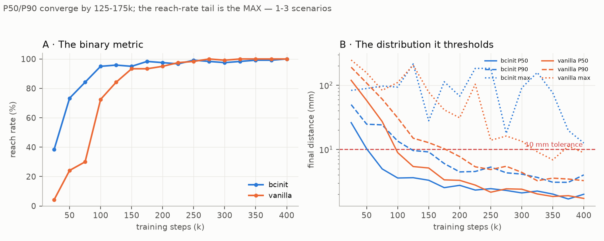
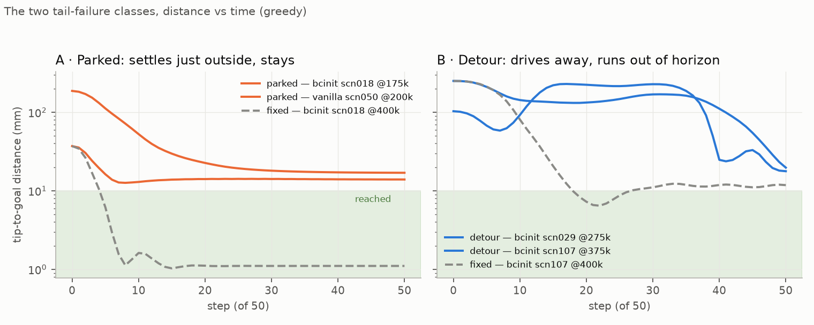
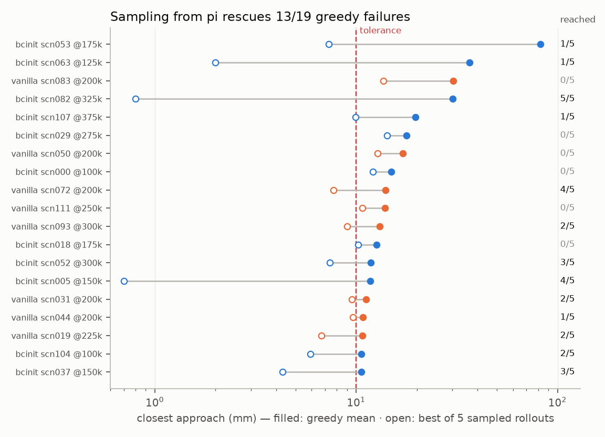
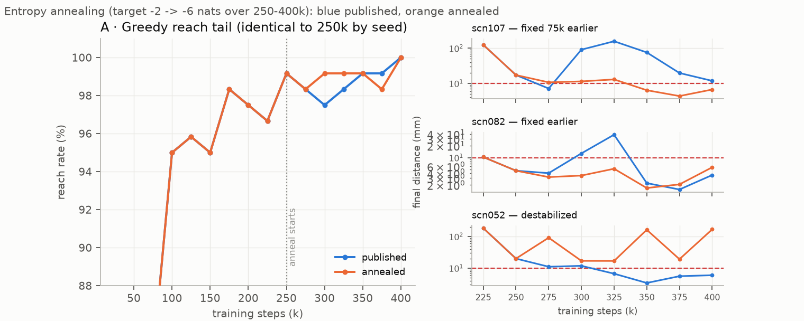

# 16. The reach-rate tail — parked means, threshold churn, and what entropy annealing proves

## Decision

The 95→100% stretch of both Reacher RL arms' reach-rate curves is **not slow
learning** and did not deserve a training fix. Per-scenario re-evaluation of
every late checkpoint shows P50/P90 of final distance converge by 125–175k
steps; everything the reach-rate plot renders as a long tail is **1–3
individual scenarios flickering across the 10 mm threshold**. The failures come
in two classes with different causes and different fixes, and the entropy-
annealing experiment run to test the dominant class **confirmed its mechanism
causally while being a net wash as a training change** — so annealing ships as
an opt-in flag with its measured result, not as a default, and the reporting
convention changes instead: **checkpoint sweeps report final-distance
percentiles alongside reach rate.**

## Context

Journey [13](13-reacher-residual.md)'s sweeps read naturally as "bcinit needs
~300k steps to close the last 5%; vanilla needs far less" — bcinit sits at
114/120 from 100k and only prints 120/120 at 400k. That framing treats the
tail as a learning problem. Before fixing it, we re-ran the 120 frozen
scenarios on every tail checkpoint of both arms *keeping the per-scenario
rows* (`scripts/sweep_checkpoints_perscn.py` — the aggregate-only sweep of
journey 13 is exactly what hid this), plus per-step traces of all 19 failing
episodes.

## The anatomy — two failure classes, neither of them "hasn't learned yet"

Panel B is the finding: **P90 final distance crosses the 10 mm tolerance at
~125k (bcinit) / ~175k (vanilla) and sits at 3–5 mm from 200k on** — bcinit
*ahead* of vanilla the whole way, so by the continuous metric the warm start
is never slower; the sample-efficiency win of journey
[10](10-sample-efficiency.md) is real in millimetres, not just in the binary
metric. The entire reach-rate tail lives in the **max** — the single worst
scenario — bouncing between 18 and 183 mm from checkpoint to checkpoint.
Borderline scenarios flip pass/fail as SAC updates jiggle the mean action
(scn052 passes at 250k, fails at 300k), so the tail is churn, not progress.

The 19 failing tail episodes (bcinit ≥100k: 11 scenarios; vanilla ≥200k: 8),
traced per step:

| class | count | signature | goal geometry |
|---|---|---|---|
| **parked** | 14/19, all 8 of vanilla's | correct elbow fold (\|q1\| at closest approach matches IK within a few degrees), one approach, then a stationary point **11–31 mm** out, flat to the horizon, torques ≈ 0 | mixed radii |
| **detour** | bcinit only: scn029/052/107 | drives the tip *away* first (103 → 215 mm mid-episode), plunges late, 50-step horizon expires with best distance at literally the last step | 33–46 mm from base, elbow folded to 150–160°, near its ±172° soft limit |

Two more measured facts. Every bcinit failure is an upper-half-plane goal and
every vanilla failure lower-half — arm-specific directional blind spots,
mechanism unidentified. And the detour trio is a **regression, not
inheritance**: the clone solves scn052 and scn107 at 3.9/4.6 mm best; SAC
training *broke* working clone behaviour on the fragile near-base scenarios
and spent ~300k steps re-fixing it. The genuinely-inherited clone failures
(scn029/082/005, clone near-misses at 12–30 mm) were fixed quickly.

## The mechanism — the greedy mean lags its own distribution

Why would a policy park 14 mm out when the reward charges `−dist` every step
and a 100-point-per-step bonus sits 4 mm away? Because nothing in SAC ever
optimizes the mean action. The actor loss is `E[Q(s, a)]` over *samples*; if
the action distribution straddles the bonus cliff, the expectation is
satisfied with the mean outside it. The MLP critic smooths the cliff, so the
gradient at the mean is gentle — and α's auto-tuning holds the policy at −2
nats forever, so the mean-vs-samples gap never closes on its own. Evaluating
`deterministic=True` then asks a question training never answered.

The probe: each failing episode re-rolled 5× with `deterministic=False` —
same weights, same scenario, sampling instead of the mean. **13/19 failures
reach**, some emphatically (scn082: mean parks at 30 mm, samples reach 5/5
with best 0.8 mm), and every non-rescued episode still gets closer. Meanwhile
the training monitors show both arms' *stochastic* behaviour policy reaching
essentially 100% of episodes from ~225k — the competence was always there;
the greedy summary of it is what the sweep measures.

## The experiment — entropy annealing, a causally clean test

If the parked offsets are the mean lagging a deliberately-wide distribution,
shrinking the distribution should convert them. `AnnealTargetEntropyCallback`
(`rl/sb3.py`) ramps `target_entropy` linearly −2 → −6 nats over 250k–400k
(`train_reacher_window.py --anneal-entropy-from 250000`); same seed as the
published run, so **every checkpoint through 250k is an exact replicate and
every post-250k difference is caused by the anneal**. On-policy action noise
fell 5× (std 0.121 → 0.025); training return and episode-success curves stay
indistinguishable throughout — only the greedy evaluation moves.

- **Predicted conversions happened**: scn107 — the published run's last
  straggler, failing until 375k — reaches from 300k on (final 90.8 → 11.4 mm
  at 300k); scn082 likewise; the annealed tail holds 119/120 from 300k
  instead of rotating 2–3 failures.
- **Costs**: P90 final distance slightly *worse* (4.0 → 5.1 mm at 400k — the
  killed exploration was still polishing precision on the easy 90%), and
  scn052 destabilized into **touch-and-go**: best 5.7 mm (so "reached" says
  success) but final 167 mm — it grazes the ball and flies off. Lower entropy
  can't repair a detour behaviour; it locks it in.
- **Net**: same 120/120 endpoint at 400k, marginally smoother tail,
  marginally worse median precision. A wash — which is itself the result: it
  confirms from the training side that the tail was a metric artifact, not a
  deficiency.

One seed; differences of 1–2 scenarios sit inside checkpoint churn. The
causal signature (stragglers converting exactly when the window opens, on an
otherwise-identical run) is the evidence, not the aggregate deltas.

Side-by-side rollouts — same scenario, same checkpoint, greedy, 2× slow
motion; left published, right annealed:

<table>
<tr><th>scn107 @350k — detour fixed</th><th>scn082 @300k — parked fixed</th></tr>
<tr>
<td><video controls loop muted playsinline width="380"><source src="../videos/anneal-scn107-350k.mp4" type="video/mp4">Your browser does not support the video tag.</video></td>
<td><video controls loop muted playsinline width="380"><source src="../videos/anneal-scn082-300k.mp4" type="video/mp4">Your browser does not support the video tag.</video></td>
</tr>
<tr><th colspan="2">…and the honest counter-example: scn052 @350k — published reaches, annealing destabilized it</th></tr>
<tr>
<td colspan="2" align="center"><video controls loop muted playsinline width="380"><source src="../videos/anneal-scn052-350k.mp4" type="video/mp4">Your browser does not support the video tag.</video></td>
</tr>
</table>

## Considered

- **Smooth the reach bonus** (replace the 100-point cliff with a steep
  sigmoid) — rejected. The env is the product ([02](02-env-design.md)); the
  unicycle uses the same bonus form, and every published number on both
  systems was earned against the cliff. A reward change is a benchmark
  redesign, not a fix.
- **Lengthen the 50-step horizon** — rejected: it would pass the detour class
  by redefining the task, hiding the regression instead of explaining it.
- **Stochastic or best-of-k evaluation** — used as a *probe* only. As a
  protocol it would change every published comparison; and on the continuous
  metrics the deterministic mean is still the better policy (median final
  ~2 mm greedy; samples are worse on average — the inversion exists only at
  the threshold).
- **BC-anchoring the warm start** (decayed BC term toward the clone, or clone
  rollouts kept in the buffer, RLPD-style) — deferred, and it is the real
  next question: the detour class is SAC unlearning clone behaviour, the same
  disease as the critic-pretrain result, and the only measurable
  bcinit-vs-vanilla difference this investigation leaves standing.

## Outcome

- `scripts/sweep_checkpoints_perscn.py` — per-scenario checkpoint sweep (the
  aggregate sweep hid the whole story); `scripts/plot_tail_figures.py` — this
  entry's four figures from that CSV.
- `rl/sb3.py::AnnealTargetEntropyCallback` + `train_reacher_window.py
  --anneal-entropy-from/--anneal-entropy-to`, opt-in, default off;
  `tests/test_entropy_anneal.py` pins the ramp and the SB3 attribute it
  relies on. Artifacts: `data/reacher_bcinit_anneal_400k.zip` and its
  checkpoint dir.
- **Reporting change**: sweeps report P50/P90 final distance next to reach
  rate. And scn052's touch-and-go exposes that `reached` (ever inside) can
  mask non-stabilizing behaviour — final-distance-under-tolerance is the
  cheap companion column, already present in every per-scenario CSV.
- Caveats: single seed; the half-plane split is observed, unexplained; the
  detour class is untouched and owns the follow-up.
