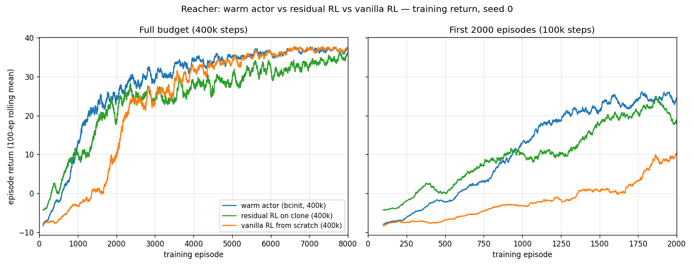
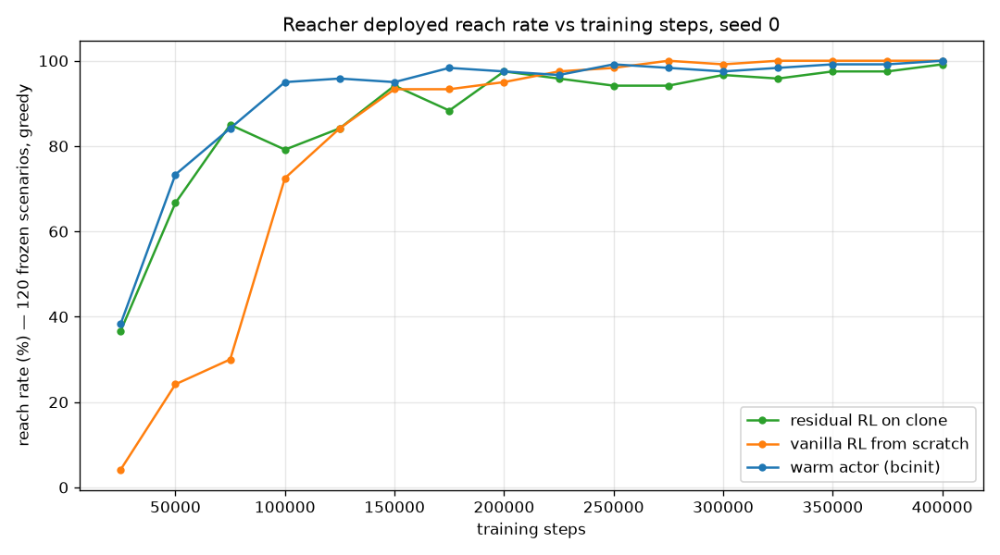

# 16. Warm-start RL — one prior, two injection sites

## Decision

Injecting the clone into the actor's **weights** (the source paper's Eq. 17) is
not the weaker architecture its Table IV predicts. On Reacher the warm arm ends
at **120/120** against the residual's 119/120, holds a **higher return asymptote**
(36.8 against 34.5), and is **19 scenarios ahead of it at 100k** (114/120
against 95/120). Prediction **P1 inverts on this system.**
Prediction **P3 is confirmed as a mechanism and refuted as a consequence**: the
cold critic really does erase the prior — 79/120 → **3/120 within 4,000 steps** —
but the collapse is transient, and both pre-registered remedies cost more than
the disease. **P2 was never measured.** Single seed; the cold control ran to
100k, not 400k.

## Context

[Journey 13](13-reacher-residual.md) put the DAgger clone's knowledge into the
**action**: freeze the clone, learn a correction on top (`u = u_base + frac ·
a_res`). Jia & Bajaj, *On Architectures for Combining Reinforcement Learning and
Model Predictive Control with Runtime Improvements* (arXiv:2510.03354) — already
cited by `reacher/residual_env.py` — proposes **two** architectures over a neural
MPC surrogate, and this repo had built only one:

| arm | paper | where the prior lives |
| --- | --- | --- |
| clone + residual | **Eq. 18**, "RL + MPC" | in the **action** — frozen clone plus a learned correction |
| clone + warm start | **Eq. 17**, "Warm Start RL" | in the **weights** — actor initialized to the clone |

[Journey 07](07-imitation-learning.md) named the missing artifact and declined to
build it ("not as a policy to fine-tune away from, but as a frozen, amortized
copy"). This entry builds it, so one prior can be measured at both injection
sites.

!!! warning "Two different things are called 'warm start' in this repo"

    Journey 13's results table has a row named **`clone + warm start`**. That is
    `reacher/eval.py::WarmStartClonePolicy` — the *base controller* driving the
    first `T_ini` steps to prime the DeePC buffer, at 83/120. It has nothing to
    do with this entry. This entry's arm is `bcinit`: SAC whose **actor weights**
    start at the clone. Both rows can appear in the same table; they are
    unrelated.

## What was run, and what wasn't

Stated up front, because three planned pieces are missing and the conclusions
are bounded by their absence.

| planned | status |
| --- | --- |
| `bcinit` arm, 400k | **run**, seed 0 |
| cold-start control, same env/script/seed | **run to 100k only** — no 400k point |
| 5 seeds per arm | **not run** — every number here is seed 0 |
| M6, inference cost per step (`scripts/measure_step_cost.py`) | **not written**; P2 untested |

## M2 — the refit moved the prior, slightly

The warm arm needs an actor that is byte-compatible with SB3's squashed-Gaussian
SAC head, so `data/dagger_clone_r3.pt` was **refit** (same dataset, same
architecture, reparameterized output) into `data/dagger_clone_r3_squash.pt`
rather than copied. That refit is a new
prior and had to be gated before any RL ran — a bad refit would invalidate the
whole framing.

```
[OPEN LOOP] 2500 held-out rows
  median |u_clone - u_select|  0.1383   (torque units, box width 2.0)
  p95                          0.6361
  median |u_select - mean|     0.2236   <- what a constant predictor would score

[CLOSED LOOP] 120 frozen scenarios, full horizon
                  reached      best     final   path/net
  Select-DPC    89/120        2.9 mm    6.4 mm     1.6
  squash clone  79/120        5.9 mm   13.8 mm     1.7
  GATE: PASS
```

The refit tracks the expert at ~60% of a constant predictor's error and lands
**10 scenarios below** it. So "the same prior" is true to within a refit: the
warm arm starts at 79/120 where the residual's frozen base was measured at
82/120.

!!! note "Do not read these against journey 13's table"

    Journey 13 reports Select-DPC at 96/120 and the clone at 82/120. This gate
    re-measured **both** under the current tree in one run and got 89 and 79.
    The paired comparison is what the gate uses and it is internally consistent;
    the difference against journey 13 is cross-tree eval drift, which journey 13
    itself warns about. Numbers from the two tables do not mix.

## M3 — P3 confirmed: the cold critic erases the prior in 4,000 steps

The spec deliberately did **not** pre-empt this. A warm actor paired with a
randomly-initialized critic is the configuration the paper says will fail, so it
was run first as a ~1-minute 20k probe, at 2k resolution, before committing any
400k budget.

| steps | reach | best | final |
| --- | --- | --- | --- |
| t=0 (the refit clone itself) | 79/120 | 5.9 mm | 13.8 mm |
| 2,000 | 12/120 | 59.1 mm | 138.0 mm |
| **4,000** | **3/120** | 101.5 mm | 151.4 mm |
| 10,000 | 8/120 | 65.6 mm | 140.9 mm |
| 20,000 | 42/120 | 15.4 mm | 36.4 mm |

Seventy-six scenarios gone in 4k steps. The actor is dragged apart by an
untrained critic exactly as predicted — P3's mechanism is real and it is not
subtle.

## The 100k three-arm sweep — and both remedies backfiring

The probe's verdict routed the budget to a 100k comparison of the warm arm
against the pre-registered remedy (**freeze the actor for 10k while the critic
fits**) and the cold control.

```
  t=0 prior (refit clone) 79/120  |  Select-DPC expert 89/120

    steps |   A warm  C warm+frozen   B cold |   C-A  p(C,A) |   A-B
    10000 |    8/120         79/120    3/120 |   +71   0.000 |    +5
    50000 |   88/120         27/120   75/120 |   -61   0.000 |   +13
   100000 |  114/120        102/120  111/120 |   -12   0.019 |    +3

  median best @100k (mm):  A 2.4   C 3.7   B 2.6
```

Three things fall out, and two of them were not the expected answer.

1. **The collapse doesn't matter.** Arm A is at 8/120 at 10k — a 71-scenario
   hole below the frozen arm, which is still sitting on the intact prior — and
   finishes as the best of the three at 100k. The catastrophe M3 measured is a
   transient, not a trap.
2. **The remedy is worse than the disease.** Freezing the actor does exactly what
   it promises — C at 10k is **79/120, the prior to the scenario**, which is the
   closed-loop invariant `tests/test_warmstart_transfer.py` pins — and then
   *lags for the rest of training*, ending 12 scenarios behind A. Protecting the
   prior from the critic costs more than letting the critic eat it.
3. **The paper's own remedy is much worse.** Critic pre-training by supervised
   MC-return regression on the clone dataset (arXiv:2510.03354 §III.C) scored
   **33/120 at 100k** — 81 scenarios behind A, having peaked at 56/120 at 90k and
   fallen back. Two measured causes: the critic only ever saw expert actions, so
   random actions score *higher* than the expert's (mean min-head Q 6.27 against
   4.98, higher on 54% of states), and MC targets carry no entropy term or
   bootstrapped tail, so early TD critic loss runs ~15–20 against ~0.1 for a cold
   critic. Fit quality was not the problem (R² 0.85). **That code was removed on
   2026-09-11** at the repo owner's request — `rl/sb3.py::pretrain_critic`, the
   `--pretrain-critic` flags, and `reacher/clone_data.py::returns_from_dataset`
   no longer exist. This paragraph and `data/qpre_sweep_100k.log` are the record.
   `FreezeActorCallback` was kept: different mechanism, and it is arm C above.

## The 400k verdict — P1 inverts





Greedy, 120 frozen scenarios, full horizon, early stopping off — journey 13's
protocol. The warm arm and vanilla were swept together in one session; the
residual row is read across a boundary that is checked below. Following journey
[17](17-reach-rate-tail.md), distances are reported as percentiles, not means:

| arm | reach @100k | reach @200k | reach @400k | best (med) | final P50 | final P90 |
| --- | --- | --- | --- | --- | --- | --- |
| Select-DPC (expert) † | — | — | 89/120 | 2.9 mm | 6.4 mm | — |
| squash clone (the prior) † | — | — | 79/120 | 5.9 mm | 13.8 mm | — |
| **BC-init (Eq. 17)** | **114/120** | **117/120** | **120/120** | 1.27 mm | 2.00 mm | 4.01 mm |
| cold-start ctrl (same env) | 111/120 | — | not run | 2.6 mm | — | — |
| clone + residual (Eq. 18) | 95/120 | — | 119/120 | 1.67 mm | 2.51 mm | — |
| vanilla RL, 8-D obs | 87/120 | 114/120 | 120/120 | **1.10 mm** | **1.73 mm** | **3.26 mm** |

Distance columns are the **400k** values for the RL rows, as in journey 13.

† Single evaluation, no training axis; printed in the `@400k` column so the
reach numbers line up. The cold control's `best` is its **100k** median; it
has no 400k point and no percentile columns because the per-scenario rows were
not kept for that arm.

The residual's row comes from `docs/reference/reacher_crossover.csv` rather than
from this sweep, which needs a word. That file's **vanilla** rows reproduce the
September per-scenario sweep *to the digit* — 87/120, 6.45 mm, 8.91 mm at 100k
and 120/120, 1.10 mm, 1.73 mm at 400k — so the two sweeps agree where they
overlap, and the residual row is being read across a boundary that has been
checked rather than assumed. The warm arm's and vanilla's percentile columns are
recomputed from `data/tail_perscn.csv`.

Training return, last-1000-episode mean at 400k: **warm 36.83, vanilla 36.98,
residual 34.46.** At episode 2,000 (100k steps, trailing-500 mean) the warm arm
is at 24.2 where vanilla is at 5.4.

**P1 — refuted, and inverted.** The paper has the warm start improving on its
surrogate by 1–5% and the residual by 12–40%. Here both improve enormously
(79/120 → 120 and 119), and the *ordering flips*: the warm arm matches the
residual on reach, beats it by 2.4 on return asymptote, and is 19 scenarios
ahead of it at 100k. (The two are within a scenario or two of each other from
25k to 75k — the warm arm's separation opens after that, not from the start.)
The architecture ranking in Table IV is task-specific, not
general — which journey 13 already hinted at when the residual beat the expert it
was cloned from.

**P2 — untested.** The paper's compensating advantage for the warm start is
runtime: one network per step against the residual's two (0.0850 µs against
0.2513 µs, Table V). `scripts/measure_step_cost.py` was never written, and this
repo still has no inference-cost number for either arm. The one axis where the
warm start was *predicted* to win is the one axis not measured.

**P3 — mechanism confirmed, consequence refuted.** See M3 and the 100k sweep. The
honest statement is "the cold critic destroys the prior and it doesn't matter on
this system at this budget," not "the cold critic is fine."

!!! warning "This design controls the prior, not the observation"

    Stated in the spec (D1) and repeated here because the table above invites the
    error. The warm arm's actor sees the clone's **43-D feature window**; the
    residual's policy sees a 10-D normalized body observation plus `u_base`;
    vanilla sees the env's 8-D observation. Holding the prior fixed is what makes
    "one prior, two injection sites" a fair question, and it costs the
    observation axis: the 8-D observation cannot be reconstructed from the DAgger
    dataset (`qvel` appears nowhere in the window), so the alternative fork would
    have required a second clone and the two arms would no longer share a prior.
    **No arrangement of these arms controls both axes**, and nothing here should
    be read as a clean warm-start-versus-residual result at equal observation.

## Considered

- **Train the warm actor on the env's 8-D observation**, making the existing
  5-seed vanilla runs a free exact control — rejected (D1): it needs a second
  clone from a second DAgger loop, so the headline comparison would no longer be
  about one prior.
- **BC-regularized actor loss, or an entropy schedule, to survive the cold
  critic** — excluded from this arm as non-goals: each adds a hyperparameter and
  breaks the one-variable delta against the control. (The entropy schedule was
  later built for a different reason — journey [17](17-reach-rate-tail.md) — and
  the BC-regularized variant is still the open follow-up.)
- **Critic pre-training** — specified, budget-gated, run, and measured harmful;
  see above. Any future attempt should start from off-manifold overestimation,
  not from fit quality.
- **Re-collecting data for the refit** — rejected: journey 14 established that BC
  failure follows the data, and this is the same student on the same
  distribution, so the dataset is reused untouched.

## Outcome

- `scripts/train_reacher_window.py` (both arms from one code path — `--clone`
  present or absent is the only difference), `reacher/window_env.py`'s
  `CloneWindowEnv`, `rl/sb3.py::init_actor_from_clone` and `FreezeActorCallback`,
  and `rl/clone.py`'s squash mode. `tests/test_warmstart_transfer.py` pins the
  transfer, including the closed-loop invariant that a frozen warm actor
  reproduces the clone over a full episode.
- Checkpoints and monitors under `data/reacher_{bcinit,cold}_*`; the gate, probe
  and sweep logs are `data/{gate_squash_clone,probe_bcinit_sweep,
  sweep_100k_3arm,qpre_sweep_100k}.log`. Both figures were generated on
  2026-09-10 from the monitor CSVs and the checkpoint sweep; like every CSV in
  this repo those inputs are gitignored, and there is no committed generator
  script for these two figures.
- **What would change the conclusions:** 5 seeds (journeys 10/13/14 make
  single-seed crossover claims non-quotable, and none is quoted here), a 400k
  cold control, and M6. Until then P1's inversion is a seed-0 result on one
  system.
- The tail this entry's sweeps show at the top end — both arms crawling from 95%
  to 100% — is **not** slow learning, and is taken apart in journey
  [17](17-reach-rate-tail.md).
