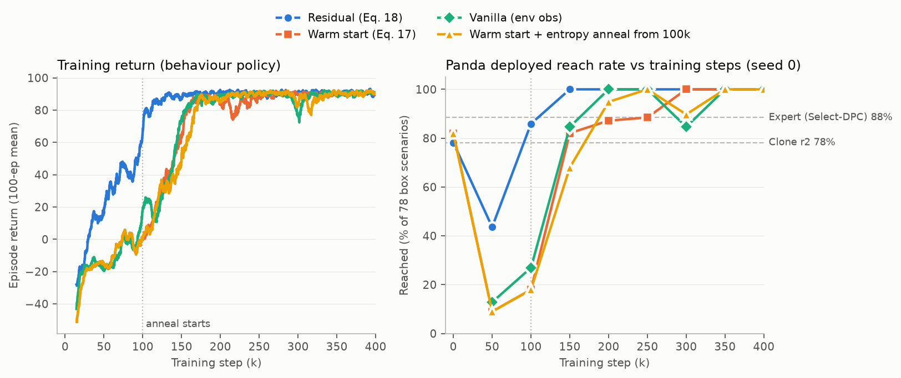
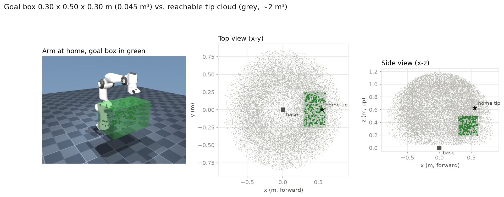
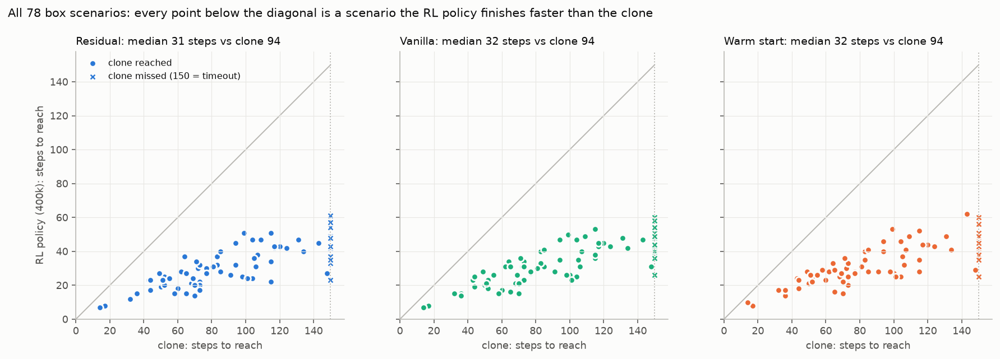

# 18. Panda RL on a goal box — the clone works once the task is local, and RL makes it optional

## Decision

Narrowing `PandaReach-v0`'s goals to a **0.30 × 0.50 × 0.30 m box in front of
the base** got the full pipeline (Select-DPC expert → behavioral clone → RL) to
run end to end on the Panda for the first time. The DAgger clone reaches
**61/78** on the frozen box scenarios (the full workspace clone reached
9/78), and every RL arm reaches **78/78** at 400k SAC steps. The Select-DPC
expert scores 69/78 on the same box. All four arms reach the same final
score, so the clone's only measurable contribution is **sample efficiency**:
the residual reaches 78/78 at **150k**, vanilla SAC (no clone) at 200k,
warm start at 300k, and the cold control at 350k. Warm start, the
architecture that won on Reacher ([16](16-warm-start-rl.md)), **collapses
from 64/78 to 7/78 within the first 50k steps** and finishes behind
vanilla. Single seed throughout.

## Motivation

[Journey 15](15-panda-taskbank.md) left the Panda with a good expert that
couldn't be deployed. Select-DPC reaches 70/78 across the whole workspace,
but each step solves a QP over a ~180,000-column bank, which takes 3.2 s
against a 20 ms control period. On the unicycle and on Reacher, the next step
was to clone the expert into an MLP and train an RL correction on top. On the
Panda, the clone failed. Seven attempts (output reparameterization, DAgger,
wider data spread, regularization, short and long rollout losses) all ended
between **2 and 9 of 78** (postmortem: `panda-clone-postmortem.html`;
figures `panda_why_clone_fails.png`, `panda_clone_dataset_coverage.png`).
Each fix improved the quantity it targeted, and the long rollout loss cut
teacher-forced drift 16×, yet reach rate stayed in that band.

The mechanism was the same one journey 15 found for the expert's data bank:
**coverage**. Measured in the clone's own feature space, the Panda's effective
dimension is 5.1 ± 0.5, against Reacher's 3.3. That puts the dimension in the
exponent of the collection cost. Halving the distance to the nearest training
state costs about 10× more placements on Reacher and about 33× on the Panda
(`panda_vs_reacher_coverage.png`, `scripts/plot_coverage_scaling.py`). The
30,000-row training set was really 200 thin threads, and only 1% of states
had a training neighbour close enough for the expert's decision to transfer.
Matching Reacher's data density over the full workspace would have taken
about 180 worker-hours of solver time.

Two ways forward were possible: buy more data across the whole workspace, or
make the region the data has to cover smaller. A clone is useful when the
expert's behaviour can be learned on the states the clone will visit. The
reachable tip cloud is ~2 m³ and wraps all the way around the base, and most
of it is irrelevant to a tabletop reach. Restricting goals to a box cuts the
volume of goal space ~45× while leaving the hard parts in place: a 7-DoF
arm, the hidden self-motion manifold, and the delta-target plant. That makes
it a test of whether the pipeline works on the Panda at all, at a coverage
budget the project could actually afford. It does not claim to solve the
full-workspace task. This entry runs that test, then asks the question
journeys 09, 13 and 16 asked of the other systems: **once RL is in the loop,
what does the clone buy?**

## Experimental setup

### Task: the goal box

- **Box** `x ∈ [0.30, 0.60]`, `y ∈ [−0.25, 0.25]`, `z ∈ [0.20, 0.50]` m
  (0.045 m³ against a ~2 m³ reachable cloud). It sits in front of the base
  and just below the `home` tip, as in a tabletop workcell.
- **Reachability is preserved by rejection, not by box sampling.** `PandaReachEnv(goal_box=...)`
  keeps sampling `sample_config` (FK of a random valid configuration) until the
  tip lands inside the box (~4% acceptance). Every goal is therefore still FK of a
  collision-free configuration, so CLAUDE.md's "every goal is reachable"
  guarantee survives. A box sampled directly in Cartesian space would not
  guarantee that.
- **Only goals are restricted.** Start configurations, `delta_max = 0.2`,
  `goal_tolerance = 0.05` m, `max_steps = 150`, reward, `Q`, and `R` are
  unchanged.
- **Frozen evaluation set** `data/panda_scenarios_box_v1.npz`: 78 scenarios,
  generated by `scripts/make_panda_scenarios.py --goal-box 0.3 0.6 -0.25 0.25 0.2 0.5`.
  The box is stored in the file, so a boxed set records what it is. Every
  number in this entry is greedy, full-horizon, on these 78.

### Clone: three DAgger rounds inside the box

Collection uses `scripts/gen_panda_clone_data.py` with the Select-DPC labeller
picked in the Phase 2 gate (`scripts/gate_panda_labeler.py`). Episodes run the
full 150 steps (station-keeping rows included), and their `(q0, goal)` pairs
are disjoint from the frozen 78.

| Round | Driver | Episodes | Rows | Driver reached | Clone trained on r0..rN | Box reach |
|---|---|---:|---:|---:|---|---:|
| r0 | expert | 100 | 15,000 | 94/100 | `panda_clone_box_r0` | 46/78 |
| r1 | clone (DAgger) | 100 | 15,000 | 62/100 | `panda_clone_box_r1` | 49/78 |
| r2 | clone (DAgger) | 1,000 | 150,000 | 683/1000 | `panda_clone_box_r2` | **61/78** |
| | | | | | `panda_clone_box_r2_squash` | **64/78** |

- Features: the 99-D window from `panda/clone_features.py`:
  `T_ini = 5` rows of applied ctrl and `y = [q; tip]`, the current `[q; tip]`,
  `tip − goal`, and buffer validity.
- Target: the **delta** `q_des − q`. This is the reparameterization that helped
  most in the full-workspace attempts.
- MLP 256×256, aggregated over all rounds (DAgger), episode-wise validation
  split.
- `_squash` is the same data trained with a `tanh` head, which SB3's SAC actor
  needs so the clone's weights can load into it exactly
  (`rl/sb3.py::init_actor_from_clone`). The warm arm uses it. The residual arm
  uses the plain `box_r2` clone.

Round r0 uses the exact recipe that gave **2/78** over the full workspace (100
expert episodes, 15,000 rows). Inside the box, the same recipe gives **46/78**.
This compares two tasks, each scored on its own 78 scenarios, so it is not a
paired result. But all of the jump comes from the task restriction, before
any further data or method change.

### RL arms

All arms use SAC from `scripts/train_panda_rl.py`: lr 3e-4, `net_arch [256, 256]`,
otherwise SB3 defaults, 400k env steps, seed 0, and a checkpoint every 50k.
Goals are drawn from the same box (`panda/rl_env.py::GOAL_BOX`).

| Arm | Env | Observation | Action → delta | Actor init |
|---|---|---|---|---|
| **residual** (Eq. 18) | `PandaResidualEnv` | env obs (24, min-max normalized) + clone delta / `δ_max` (7) | `clip(u_clone + δ_max·a, ±δ_max)` | zero (`zero_init_actor`), so step 0 = clone |
| **warm** (Eq. 17) | `PandaWindowEnv` | clone's raw 99-D window | `δ_max·a` | squash clone's weights, `log σ = log 0.1` |
| **warm + anneal** | `PandaWindowEnv` | same | same | same, plus target entropy annealed −7 → −21 from 100k ([17](17-reach-rate-tail.md)) |
| **cold** | `PandaWindowEnv` | same | same | random. Differs from warm **only** in the init. |
| **vanilla** | `PandaVanillaEnv` | env's own 24-D obs | `δ_max·a` | random, no clone anywhere |

Equation numbers follow Jia & Bajaj (arXiv:2510.03354), as in journey 16.
`Window` is the clone's `(u_ini, y_ini)` buffer, and it slides with `(applied
ctrl, pre-step y)`, the same labelling the clone was trained under. With a
zero residual, the residual arm runs exactly the clone's closed loop.
`RLPolicy` drives that same `Window` at evaluation, so training and scoring
can't drift apart.

### Evaluation

Each 50k checkpoint is scored greedily on the frozen 78 through
`panda/eval.py::run_scenarios`, the same harness as the clone rows
(`data/panda_rl_sweep.csv`; finals in `data/panda_results.csv`). Reach is
`‖tip − goal‖ < 0.05` m at any step. Steps-to-reach and effort (Σ‖δ‖) are
taken from the same episodes.

## Results

### Reach rate per checkpoint (of 78)

| Step | residual | warm | warm + anneal | cold | vanilla |
|---:|---:|---:|---:|---:|---:|
| 0 | 61 (clone) | 64 (clone) | 64 (clone) | — | — |
| 50k | **34** | 7 | 7 | 4 | 10 |
| 100k | **67** | 14 | 14 | 16 | 21 |
| 150k | **78** | 64 | 53 | 20 | 66 |
| 200k | 78 | 68 | 74 | 46 | **78** |
| 250k | 78 | 69 | 78 | 73 | 78 |
| 300k | 78 | **78** | 70 | 77 | 66 |
| 350k | 78 | 78 | 78 | **78** | 78 |
| 400k | 78 | 78 | 78 | 78 | 78 |

- **The residual is the only arm that never falls far below its prior.** It
  dips to 34 at 50k, recovers past the clone by 100k, and from 150k on it
  holds 78/78 at every checkpoint. It also has the earliest stable return in
  the left panel by roughly 50k steps.
- **Warm start loses the clone almost immediately.** 64 → 7 by 50k, then it
  tracks vanilla's curve rather than leading it. This is journey 16's
  mechanism (P3: the randomly initialized critic's gradients overwrite the
  actor's prior). On Reacher, the warm arm recovered fast enough to stay ahead
  of vanilla. On the Panda it doesn't: warm reaches 78/78 100k steps after
  vanilla.
- **Entropy annealing didn't change that.** Its 50k and 100k checkpoints are
  identical to warm's (annealing starts at 100k), and afterwards the two
  curves trade places within a few scenarios. Annealing made no measurable
  difference here, consistent with journey 17's "net wash".
- **The cold control is the slowest**, 350k. It shares warm's 99-D window
  observation, while vanilla uses the env's 24-D one, and vanilla is 150k
  faster. So on this env the windowed observation costs more than the clone's
  weights recover.
- **Non-monotone checkpoints are threshold churn, not regressions.** Vanilla
  drops 78 → 66 at 300k and recovers by 350k. Warm + anneal drops 78 → 70.
  The median final distance stays at 0.044–0.047 m throughout, just inside
  the 0.05 m tolerance, which is the parked-near-the-boundary pattern from
  journey 17.

### What RL changes about the trajectories

| Method | Reached | Median steps (reached) | Mean effort Σ‖δ‖ |
|---|---:|---:|---:|
| Select-DPC expert | 69 | — | — |
| clone `box_r2` | 61 | 77 | 2.97 |
| clone `box_r2_squash` | 64 | 76.5 | 3.32 |
| residual 400k | 78 | 31 | 6.67 |
| warm 400k | 78 | 31.5 | 5.79 |
| warm + anneal 400k | 78 | 34 | 6.87 |
| cold 400k | 78 | 34 | 5.92 |
| vanilla 400k | 78 | 32 | 5.68 |

Every RL policy finishes every scenario faster than the clone. Every point
in the figure lies below the diagonal, and the 17 scenarios the clone misses
take 25–60 steps under RL. The RL policies roughly double the clone's effort
to do it. The reward's `R = 1e-2·I₇` prices effort low enough that arriving
2.5× sooner pays for it. Of the arms, the residual spends the most effort and
vanilla the least: the residual keeps the clone's action and adds a
correction on top, so it moves more joint angle per step. Per-scenario paths
for four representative cases are in `panda_rl_traj_s{10,49,54,68}.png`,
generated by `scripts/plot_panda_rl_trajectories.py`, and
`videos/panda_rl_vs_clone.mp4` shows clone / residual / vanilla / warm side
by side.

## Considered

- **Buy full-workspace coverage instead of shrinking the task.** The measured
  coverage exponent puts this at about 180 worker-hours of solver time for
  Reacher-level density, and even then the clone would only be the *starting
  point* for RL. Not run. The box answers the pipeline question at about 1%
  of the cost.
- **Skip the clone and run RL on the full workspace.** This is the honest
  next comparison, and it isn't settled here. The box results suggest
  vanilla would get there too, but they don't show it.
- **A smaller or bigger box.** A smaller box would make the clone look better
  and teach less. The chosen box is the size of a tabletop workcell, and the
  rejection sampler's ~4% acceptance rate keeps resets cheap. A box much
  smaller than this one would need IK-checked sampling (the `ponytail:`
  comment in `panda/env.py`).
- **More warm-start remedies.** [Journey 16](16-warm-start-rl.md) already
  measured both pre-registered remedies (freezing the actor for 10k steps while
  the critic warms up, and critic pretraining on MC returns) and found that each
  cost more than the collapse it was meant to prevent. Entropy annealing was the one
  remaining cheap lever, and it was run.

## Outcome

- `PandaReachEnv(goal_box=...)` with rejection sampling. `panda/scenarios.generate`
  and `make_panda_scenarios.py --goal-box` record the box in the frozen file.
  New frozen set `data/panda_scenarios_box_v1.npz`.
- `panda/clone_data.py`, `panda/clone_features.py`, `scripts/gen_panda_clone_data.py`,
  `scripts/train_panda_clone.py`, `scripts/validate_panda_clone.py`: the Panda
  clone pipeline, with DAgger rounds and a `--squash` head for warm start.
  `ClonePredictor.stats` now carries the clone's target convention, so a delta
  clone can't silently be read as an absolute one.
- `panda/rl_env.py` (residual / window / vanilla envs, shared `Window`,
  `RLPolicy`) and `scripts/train_panda_rl.py --arm {residual,warm,cold,vanilla}`.
- Figures: `panda_goal_box.png`, `panda_rl_curves.png`,
  `panda_rl_vs_clone_steps.png`, `panda_rl_vs_clone.png`,
  `panda_rl_traj_s*.png`.
- **Reporting convention:** because every arm saturates at 78/78, Panda RL arms
  are compared on reach at a fixed budget (50k–200k), not on the final score.

## Caveats

- **Single seed, single run per arm.** The ordering residual < vanilla <
  warm < cold is based on one seed. Gaps of 50k steps between neighbours
  are within what a second seed could reorder; the residual's 150k lead over
  cold is the most robust gap.
- **Checkpoint granularity is 50k.** "Reaches 78/78 at 150k" means at the
  first scored checkpoint where it does. The warm arm's collapse is visible
  only as 64 → 7 at 50k. Its onset wasn't measured on the Panda (journey 16
  measured it at 4,000 steps on Reacher).
- **The expert's 69/78 on the box is a recorded constant**
  (`plot_panda_rl_curves.py --expert`), not a row in `panda_results.csv`.
  The other per-scenario evals are in the CSVs. The expert's 94/100 in the
  r0 table is on *training* episodes, not the frozen 78.
- **The box changes the task, not just the data.** "61/78 vs 9/78" compares
  two goal distributions, each with its own frozen set. It shows that the
  pipeline works once the task is local, not that the clone improved on the
  original task.
- **The cold arm is missing from `panda_rl_curves.png`.** Its numbers are in
  the table above and in `data/panda_rl_sweep.csv`.
