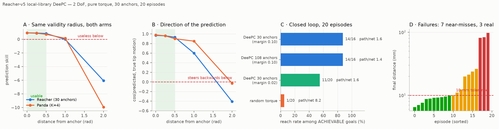
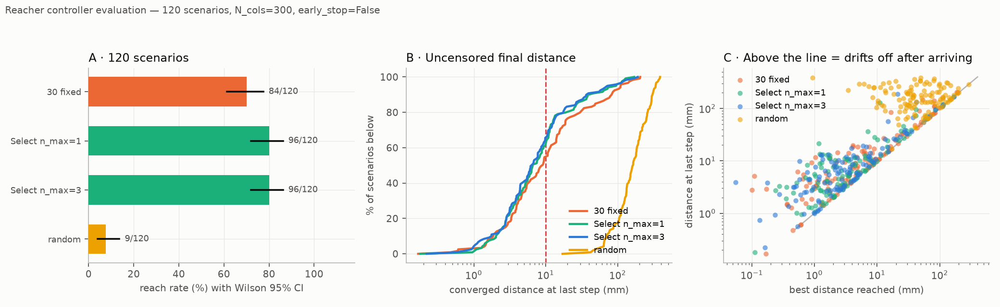
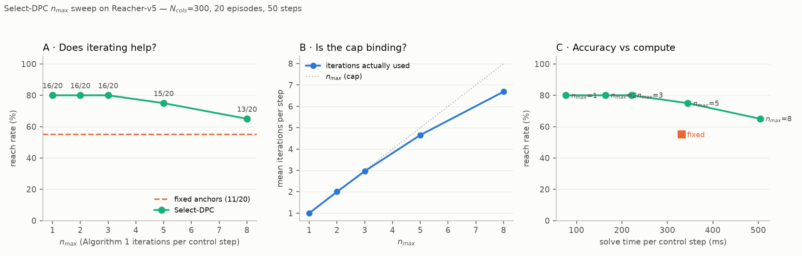
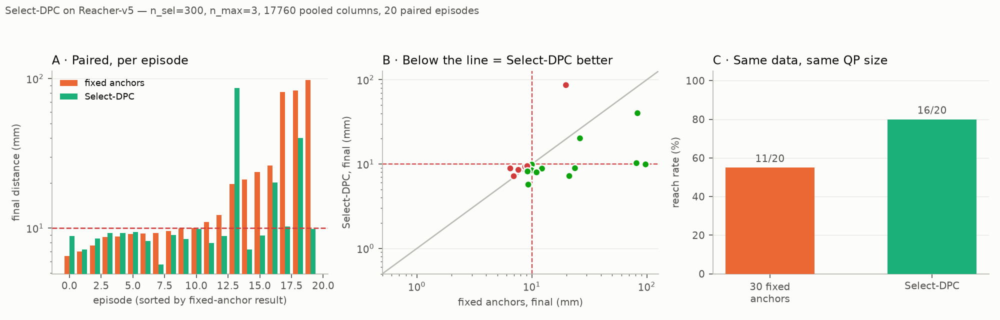

# Reacher-v5 reference

The **third system** in this repo: Gymnasium's 2-link planar arm, used as the
tractable control for the Panda work. Pure reference — the *why* is
[journey 12](../journey/12-select-dpc.md).

The one-line summary: 2 joints drive a 2-D fingertip, so `q → tip` is generically
locally invertible and nothing is hidden from the output. That is the property
`PandaReach-v0` lacks, and it is why a local-library DeePC that fails on the Panda
succeeds here at a data budget of tens of trajectories rather than ~10⁵.

## Two layers: a bare MuJoCo module, and a Gym env on top

The classical controllers never touch Gymnasium. `reacher/model.py` compiles
Gymnasium's own bundled `reacher.xml` and drives it through the MuJoCo bindings
directly:

```python
from reacher.model import load_model, sample_config, sample_goal, set_state, step_torque, frame_skip

model, data = load_model()          # gymnasium/envs/mujoco/assets/reacher.xml
fs = frame_skip(model)              # 2 physics steps per control step
rng = np.random.default_rng(0)

q, tip = sample_config(model, data, rng)
goal = sample_goal(rng)
set_state(model, data, q, goal)     # writes qpos[0:2] AND qpos[2:4]
ctrl = step_torque(model, data, u, fs)
```

That module has no observation vector, no reward function and no `step()`
returning `terminated` — episodes are driven by the scripts, which own their own
reach criterion (`--tol`, default 10 mm) and step budget (`--steps`, default 50,
the `Reacher-v5` horizon). It is a control-oriented layer over the model, not an
RL env.

`reacher/env.py` adds the RL-facing layer on top: Gym ID **`ReacherGoal-v0`**,
registered on `import reacher`, with `max_episode_steps=None` because the env
truncates itself. It is additive — DeePC and Select-DPC still go through
`reacher/model.py`, and no classical number moved when it landed. Its signals are
in [RL interface](#rl-interface-reachergoal-v0) below.

## Quick orientation

All values read off the compiled model, not the XML text.

| Concept | Value |
|---|---|
| Model | `reacher.xml`, shipped with `gymnasium.envs.mujoco` (no `robot_descriptions` fetch, no network) |
| `nq` / `nv` / `nu` | `4` / `4` / `2` |
| `opt.timestep` | `0.01` s, `frame_skip = 2` → `dt_ctrl = 0.02` s, **50 Hz** |
| `qpos[0:2]` | the **arm** joints — `joint0` unlimited (wraps), `joint1 ∈ [−3.0, 3.0]` |
| `qpos[2:4]` | the **target's** x/y slide joints, `± 0.27` — *not* the arm |
| Action `u` | `ctrl ∈ [−1, 1]²`, `gaintype=FIXED`, `biastype=NONE`, `gear=200` → **torque = 200·ctrl** |
| `dof_damping` / `armature` | `[1, 1]` / `[1, 1]` |
| Link lengths | `0.10` / `0.11` m → reach `0.21` m |
| Fingertip radius over the *hardware* range | `[0.018, 0.210]` m |
| Fingertip radius over the *safe box* | `[0.029, 0.210]` m (see below) |
| Goal distribution | uniform in a disc of radius `0.20` — how `Reacher-v5` itself draws it |
| Gravity term | **zero**: planar arm, gravity perpendicular. `u = 0` for 50 steps moves the joints by `0.0000` rad |

`u = 0` genuinely means *hold*. Contrast the Panda under torque, where the tip
falls 185 mm in 0.2 s, and the Panda's PD position servo, where the plant's real
input is `ctrl`, not the commanded delta. Here `ctrl` **is** the torque, with
nothing in between.

## Three traps

### `qpos[2:4]` is the goal

The target is part of the simulator state, so "set the goal" means writing into
`qpos`. Any code that resets `qpos` wholesale silently moves the target too.
`set_state(model, data, q_arm, goal=None)` writes the arm block always and the
target block only when a goal is passed, and zeroes `qvel` — it is a reset, not a
nudge.

### `SAFE_MARGIN` does not port from the Panda

`panda/model.py` trims joint ranges by `SAFE_MARGIN = 0.10` to keep excitation off
a hard limit, which would be a nonlinearity the local libraries must model. That
reasoning **inverts** here: `joint1`'s limit is what lets the arm fold, and folding
is what reaches targets near the origin.

`reachable_annulus(model)` returns `r_min = √(L1² + L2² + 2·L1·L2·cos q1_max)`:

| `SAFE_MARGIN` | joint1 limit | reachable annulus | share of the 0.20 m goal disc made **impossible** |
|---|---|---|---|
| `0.10` (the Panda's) | `abs(q1) ≤ 2.40` | `[0.0767, 0.21]` m | **14.7 %** |
| `0.02` (used here) | `abs(q1) ≤ 2.88` | `[0.0291, 0.21]` m | 2.1 % |

At the Panda's margin, one goal in seven is unreachable and reads as controller
failure. `is_reachable(model, goal)` exists to make that checkable rather than
discoverable — four of twenty goals were unreachable before this was caught.

### `joint0` wraps, so plain norms lie

`joint0` is unlimited, so `−3.1` and `+3.1` rad are `0.08` rad apart, not `6.2`.
Every anchor, coverage and library-selection computation must go through
`config_distance(q, anchors)` (which wraps the first component) or `wrap()`, never
`np.linalg.norm` on a raw difference.

A consequence worth knowing: `q0` is an **exact symmetry** of the dynamics
(measured `1.735e-16` m), so a `6 × 5` anchor grid encodes only **5 distinct sets
of dynamics** replicated at 6 base rotations. Anchoring on `q1` alone and rotating
the fingertip block would remove that 6× redundancy. Untried.

## DeePC interface

`reacher/deepc_setup.py`. Signals — what `u` and `y` mean to the controller in
general is [the DeePC signals section](../controllers/deepc.md#signals-the-control-input-u-and-the-output-y);
this is what Reacher plugs in:

| | |
|---|---|
| `u` | `τ ∈ [−1, 1]²` — the actuator input, a genuine torque, and **the identical signal** the RL policies emit as their action |
| `y` | `[q; fingertip] ∈ ℝ⁴` — `outputs(q_traj, tip_traj)` |
| `y_ref` | `[0, 0, gx, gy]` — `y_ref_for(goal)`; the joint block is unweighted, so its value is free |
| `Q` | `diag(0, 0, 1, 1)` — tracking cost is **fingertip-only** |
| `R` | `1.0e-3 · I₂` |

### `u` — 2-D joint torque, `m_u = 2`

`u = (τ₀, τ₁) ∈ [−1, 1]²`, one component per arm joint, written straight into
`data.ctrl` by `step_torque`.

- **It is a genuine torque.** `gaintype=FIXED`, `biastype=NONE`, `gear=200`, so the
  applied joint torque is `200·u` N·m. Nothing sits between the controller's number
  and the plant. Contrast the Panda, where `u` is a delta into a PD position servo
  and the plant's true input is the post-clip `ctrl` — the distinction that forces
  two `u` conventions there and none here.
- **It is the identical signal the RL policies emit.** `ReacherGoal-v0`'s action
  space is the same `[−1, 1]²`, so a QP solve and a policy forward pass are
  interchangeable at the plant boundary. That is what makes the clone, the residual
  and DeePC comparable at all — see [RL interface](#rl-interface-reachergoal-v0).
- `u_bounds = (−1, +1)` per joint, matching the actuator's own `ctrlrange`.
  `step_torque` clips to the same box, so the QP bound and the plant agree rather
  than the bound adding a restriction.
- **`du_max` is `None`, and nothing is missing.** A torque may jump between steps
  without leaving the region its library describes, and the box is native. The Panda
  needs a rate limit precisely because its `u` is an absolute position target.
- `R = 1.0e-3 · I₂` therefore penalizes **genuine control effort**. Under the
  Panda's position servo the same `uᵀRu` penalized distance from `q = 0` — same
  formula, different meaning, because `u` is a different kind of object there.

### `y` — 4-D, joints stacked on fingertip, `p_y = 4`

`y = [q₀, q₁, tip_x, tip_y]` = `outputs(q_traj, tip_traj)`: two radians followed by
two metres.

| block | components | units | what it does |
|---|---|---|---|
| `y[0:2]` | `q₀, q₁` | rad | keys the library, informs prediction — **not tracked** |
| `y[2:4]` | `tip_x, tip_y` | m | tracked against the goal |

The controller's [three jobs for `y`](../controllers/deepc.md#signals-the-control-input-u-and-the-output-y)
land on different blocks here:

1. **Library selection reads `y[0:2]` only.** `ReacherDeePC._select_index_for`
   overrides the base class, which keys on a scalar and picks the nearest anchor
   *on a circle* — right for a heading, wrong for a 2-D configuration. It uses
   `config_distance`, which **wraps** the first component, since `joint0` is
   unlimited.
2. **The past buffer takes all four.** At `T_ini = 5`, `u_ini` is `(5, 2)` and
   `y_ini` is `(5, 4)`.
3. **Tracking sees `y[2:4]` only**, because `Q = diag(0, 0, 1, 1)`.

`y_ref = [0, 0, gₓ, g_y]`. The joint block's value is arbitrary and never read, its
weight being zero — the zeros are a placeholder, **not a target pose**. Only the tip
block carries the goal.

Two consequences of putting the *fingertip* in `y` rather than a scalar
goal-distance:

- The libraries are **goal-free**, so one Hankel build serves every target and the
  goal enters only through `y_ref`.
- The joint block makes the state observable through the `Yp`/`Yf` constraints. On a
  2-link arm `q → tip` is already generically invertible, so this earns less here
  than on the Panda where it was measured; it costs nothing and keeps both setups the
  same shape.

### Shapes at the defaults

`T_ini = 5`, `N = 12`, `T = 1200` samples per anchor, so `L = T_ini + N = 17` and
`n_cols = T − L + 1 = 1184`:

| | | |
|---|---|---|
| `Up` | `(T_ini·m_u, n_cols)` | `(10, 1184)` |
| `Uf` | `(N·m_u, n_cols)` | `(24, 1184)` |
| `Yp` | `(T_ini·p_y, n_cols)` | `(20, 1184)` |
| `Yf` | `(N·p_y, n_cols)` | `(48, 1184)` |

The default `6 × 5` grid gives 30 anchors, hence 30 such libraries. All share
`n_cols`, since they take turns filling one cached QP's parameters.

!!! note "`τ` means two things in this document"
    Above, `u = τ` is the joint torque. Under [Select-DPC](#select-dpc) below, `τ`
    is the paper's stacked *trajectory* vector that column selection scores
    against. Different objects; the collision comes from the two papers, not from
    this repo.

### Excitation carries a restoring term, and it is not optional

Under torque the plant is a damped double integrator. Nothing pulls the arm back,
so plain OU torque random-walks away from the anchor and the library ends up
describing wherever it drifted rather than the anchor's neighbourhood.
`collect_anchor` adds a weak PD toward the anchor — weak enough that the excitation
still dominates the local response, strong enough to keep the walk bounded — and
returns the achieved `spread` so this can be checked rather than assumed.

| parameter | value | role |
|---|---|---|
| `OU_THETA` | `0.85` | OU correlation |
| `OU_SIGMA` | `0.35` | excitation, as a fraction of the `±1` torque range |
| `K_RET` | `0.8` | restoring gain toward the anchor |
| `K_DAMP` | `0.15` | velocity damping in the restoring term |
| `DEFAULT_T` | `1200` | samples per anchor |

`y_t` is recorded **before** `u_t` is applied, so `y_{t+1}` is the response to
`u_t` — the alignment every other collection in this repo uses.

### Anchors and library selection

Anchors sit on a uniform `(q0, q1)` grid, not k-medoids: in 2-D a grid is
near-optimal for worst-case coverage, and the Panda work established there is no
cluster structure to discover (silhouette flat at 0.23–0.28 for every `K`). `q0` is
periodic, so its samples exclude the duplicate endpoint.

For `--grid n0 n1`, the grid steps are `2π/n0` in `q0` and `5.76/(n1−1)` in `q1`.
The default `6 × 5` gives 30 anchors × `T = 1200` = 36 000 samples.

`ReacherDeePC` overrides `_select_index_for` because the base class keys on a
scalar and picks the nearest anchor *on a circle* — right for a heading, wrong for
a 2-D configuration. The key is read straight off `y`, whose first two components
are `q`, through the wrapping `config_distance`.

### Controller defaults

`make_controller(payload, ...)` — built once, serves every target via
`y_ref_for(goal)`.

| | `T_ini` | `N` | `λ_g` | `λ_y` | `u` bounds | `du_max` | solver |
|---|---|---|---|---|---|---|---|
| default | `5` | `12` | `5e-3` | `7.5e3` | `±1` | `None` | `SCS` |

`predict(...)` is the QP-free open-loop gate: regularized least squares on
`[Up; Yp; Uf]`, returning the predicted `Yf` block. Used by the skill/cos
diagnostics below.

## Select-DPC

`reacher/selectdpc.py` is a ~30-line adapter; the algorithm is
`core/selectdpc.py`, faithful to Algorithm 1 + 2 of
[arXiv:2503.18845](https://arxiv.org/abs/2503.18845) and system-agnostic.
`trajectory_bank(payload, T_ini, N, stride)` pools a `deepc_setup` collection
payload into a bank.

Reacher needs **none** of the Panda's corrections: torque is natively bounded to
`[−1, 1]`, so no rate limit is required, and `τ` stacks torque, radians and metres
whose numeric scales are close enough that the paper's plain norm is reasonable
as-is. The Panda's `τ` under-weights its tip block ~10×.

Two design parameters, easy to conflate: `n_cols` (the paper's `N_cols`, columns
selected per solve, held at 300 throughout) and `n_max` (the iteration cap).

## RL interface — `ReacherGoal-v0`

`reacher/env.py`. Two RL arms consume it — `scripts/train_reacher_vanilla.py` and
`scripts/train_reacher_residual.py` — and **they do not see the same observation
vector.** The *why* is [journey 13](../journey/13-reacher-residual.md); this is the
contract.

### The env itself

| | |
|---|---|
| Observation | `[cos q (2), sin q (2), qvel (2), tip − goal (2)] ∈ ℝ⁸`, bounds `[±1, ±1, ±50, ±0.5]` |
| Action | `τ ∈ [−1, 1]²` — the same actuator input DeePC drives, so a policy and a QP command the identical plant |
| Reward | `−‖tip − goal‖ − 1e-3·τᵀτ + 1.0·[dist < 0.01]`, dense and **unsquared** |
| Horizon | `max_steps = 50`; `terminated` is **always False**, only `truncated` fires |
| `goal_tolerance` | `0.01` m |

Three things the observation's shape encodes:

- **Angles enter as `cos`/`sin`, never raw.** `joint0` is unlimited and wraps, so a
  raw angle is discontinuous at ±π and the policy would see a cliff there — the
  same fact that forces `config_distance` on the DeePC side.
- **`qvel`'s ±50 bound is an observation box, not a physical limit.** Torque ×
  `gear = 200` exceeds it transiently, so `build_obs` **clips** into the box rather
  than the box being widened; an observation outside its declared space silently
  breaks SB3's normalization and gymnasium's checker.
- **The goal enters only as `tip − goal`.** No absolute target coordinates, so the
  policy is invariant to where in the workspace the episode happens — the analogue
  of the unicycle's body-frame observation.

**The observation is not `y`.** `y = [q; fingertip] ∈ ℝ⁴` stays exactly as
`deepc_setup` defines it and is exposed as a property, so a Select-DPC buffer and
this env's measurement remain the same object. The 8-D vector above is the policy
input and nothing else reads it.

**Neither arm is a POMDP.** The reward is a function of the applied torque and the
post-step distance, both visible to the agent. Contrast the unicycle
([journey 09](../journey/09-vanilla-rl.md)), whose `Q₂₂δ²` term is in absolute
world heading while `δ` appears nowhere in the body-frame observation — up to 19.7
reward per step unexplainable from the agent's view.

### Vanilla — the env, unwrapped

SAC on `gym.make("ReacherGoal-v0")` with only a `Monitor` around it. **No
`RescaleObservation`, no `VecNormalize`**: the policy consumes the raw 8-D vector
with `qvel` at its native scale. Evaluation feeds `env.unwrapped.build_obs()`, the
same raw vector, so training and evaluation agree with each other.

They do *not* agree with the residual arm, which normalizes. On the unicycle both
arms were min-max scaled alike (journey 09); here they are not, and that is an
uncontrolled difference between the two arms rather than a measured choice —
journey 13's caveat about the residual's ~18× channel compression is the same
issue seen from the other side.

### Residual — `u_base` appended, everything normalized

`reacher/residual_env.py::ResidualSelectEnv` wraps the same inner env around a
frozen clone of the base controller.

| | |
|---|---|
| Observation | the inner 8 **plus the clone's `u_base` (2)** = `ℝ¹⁰`, min-max mapped to `[−1, 1]` |
| Action | `a_res ∈ [−1, 1]²` — a **correction**, not a torque |
| Applied | `u = clip(u_base + residual_frac · half_range · a_res, −1, 1)`, `half_range = 1.0` |

`half_range` is 1.0 because the torque box is already `[−1, 1]`, so `residual_frac`
reads directly as the fraction of full authority the policy may add. Normalization
is against the declared bounds, not running statistics — nothing to persist, and
the zero-residual invariant survives it.

Two consequences worth knowing:

- **The residual sees history only through `u_base`.** The clone's features come
  from a `T_ini = 5` buffer of `(applied u, pre-step y)`; the residual policy's own
  observation is memoryless. The buffer slide uses exactly the labelling the clone
  was trained under, so a zero residual reproduces the clone's closed loop
  bit-for-bit, and `zero_init_actor` zeroes the actor's mean head so training
  *starts* there.
- **The `residual_frac` defaults disagree between training and evaluation.**
  `train_reacher_residual.py` still defaults to `1.0`, while
  `eval_reacher_residual.py` and `sweep_reacher_checkpoints.py` default to `2.0`.
  Every residual number in journey 13 is a **`--residual-frac 2.0`** run, so pass
  it explicitly when training or the policy learns against half the authority it is
  later evaluated with. Frac 1.0 loses to 2.0 on every seed (400k pooled: 578/600
  at 3.13 mm against 589/600 at 2.51 mm) — the unicycle's dead-zone lesson,
  measured again here.

## Measured results

### The validity radius is ~0.5 rad on both arms

Open-loop skill and direction quality vs distance from the nearest anchor
(`scripts/run_reacher_deepc.py`, `scripts/verify_libraries.py` for the Panda):

| radius (rad) | Panda skill | Reacher skill | Panda cos | Reacher cos |
|---|---|---|---|---|
| 0.00 | 0.93 | 0.94 | 0.98 | 0.97 |
| 0.25 | 0.88 | 0.91 | 0.96 | 0.96 |
| 0.50 | 0.72 | 0.84 | 0.90 | 0.93 |
| 1.00 | 0.14 | −0.02 | 0.85 | 0.60 |
| 2.00 | −9.93 | −6.06 | −0.03 | −0.41 |

Different actuation, different dimensionality, different gravity situation, same
boundary. The two systems' outcomes differ only through *where they operate*.



### Closed loop, 120 scenarios

Early stopping **off**, Wilson 95 % intervals (`scripts/eval_reacher_scenarios.py`):

| controller | reach rate | best | final | steps | path/net | time |
|---|---|---|---|---|---|---|
| 30 fixed anchors | 84/120 [61–77 %] | 4.3 mm | 8.9 mm | 21 | 1.6 | 22.0 m |
| **Select `n_max=1`** | **96/120 [72–86 %]** | 3.0 mm | 6.6 mm | 16 | 1.5 | **5.5 m** |
| Select `n_max=3` | 96/120 [72–86 %] | **2.8 mm** | **6.3 mm** | 18 | 1.6 | 16.0 m |
| random torque | 9/120 [4–14 %] | 42.1 mm | 161.7 mm | 20 | 7.6 | — |

The Wilson intervals overlap slightly; the paired tests carry the claim
(`n_max=1` closer on 70/120, `n_max=3` on 78/120).

**Read `best` and `final` together.** Every controller arrives at roughly half its
final error and then backs off by the same factor (~2.1–2.3×; random 3.8×). There
is no terminal cost and nothing rewards station-keeping, so every reach rate in
this project flatters its controller — they touch the target and leave.



### `n_max = 1` is the right setting

`scripts/sweep_select_dpc.py`, 20 episodes (fixed anchors: 11/20, 331.9 ms/step):

```
n_max        1      2      3      5      8
reached     16     16     16     15     13
ms/step   76.7  163.7  221.4  344.8  504.4
iters     1.00   2.00   2.97   4.66   6.69
```

The entire gain over fixed anchors comes from *selecting the right data*, not from
Algorithm 1's loop. Beyond `n_max = 3` it is strictly dominated — slower *and*
worse. Iteration buys only precision: `n_max=3` converges 0.3 mm tighter at 3× the
cost.




### What it looks like

Top-down, 0.21 m workspace. The red sphere is the target; the ring around it is
the 10 mm reach tolerance, drawn because at 1 cm against a 21 cm workspace a miss
and a reach are otherwise indistinguishable.

**DeePC vs random torque**, same episodes (`scripts/record_reacher_video.py`):

<table>
<tr><th></th><th>DeePC (30 anchors)</th><th>random torque</th></tr>
<tr>
<td><b>reached</b></td>
<td><video controls loop muted playsinline width="330"><source src="../videos/reacher-deepc-reached.mp4" type="video/mp4">Your browser does not support the video tag.</video></td>
<td><video controls loop muted playsinline width="330"><source src="../videos/reacher-random-reached.mp4" type="video/mp4">Your browser does not support the video tag.</video></td>
</tr>
<tr>
<td><b>failure</b></td>
<td><video controls loop muted playsinline width="330"><source src="../videos/reacher-deepc-failure.mp4" type="video/mp4">Your browser does not support the video tag.</video></td>
<td><video controls loop muted playsinline width="330"><source src="../videos/reacher-random-failure.mp4" type="video/mp4">Your browser does not support the video tag.</video></td>
</tr>
</table>

**Fixed anchors vs Select-DPC**, same scenarios, early stopping **off**
(`scripts/record_reacher_compare.py`). The readout carries both the current and
the best-so-far distance, so a controller that arrives and leaves shows up as the
two numbers separating:

<table>
<tr><th></th><th>fixed anchors</th><th>Select-DPC</th></tr>
<tr>
<td><b>rescue</b><br><small>fixed misses, Select reaches — where selection earns its keep</small></td>
<td><video controls loop muted playsinline width="330"><source src="../videos/reacher-fixed-rescue.mp4" type="video/mp4">Your browser does not support the video tag.</video></td>
<td><video controls loop muted playsinline width="330"><source src="../videos/reacher-select-rescue.mp4" type="video/mp4">Your browser does not support the video tag.</video></td>
</tr>
<tr>
<td><b>drift</b><br><small>largest best-vs-final gap — the failure the reach rate hides</small></td>
<td><video controls loop muted playsinline width="330"><source src="../videos/reacher-fixed-drift.mp4" type="video/mp4">Your browser does not support the video tag.</video></td>
<td><video controls loop muted playsinline width="330"><source src="../videos/reacher-select-drift.mp4" type="video/mp4">Your browser does not support the video tag.</video></td>
</tr>
</table>

`record_reacher_compare.py` also emits `both` and `neither` cases, and
`record_reacher_video.py` a `near-miss` pair; neither is reproduced here.

### Denser anchors bought almost nothing

Predicted, then measured: 3.6× the anchors (30 → 108) bought **one** extra reach,
13/20 → 14/20, while the open-loop gate improved exactly as predicted. Prediction
improving without reaching improving is a pattern worth distrusting on sight.

## CLI

All defaults are baked into `argparse`; there are no config files.

| script | what it does | key flags |
|---|---|---|
| `scripts/run_reacher_deepc.py` | the three-stage pipeline: open-loop gate, then closed-loop reaching vs a random-torque control on identical episodes | `--grid 6 5` `--T 1200` `--episodes 20` `--steps 50` `--tol 0.01` `--radii 0 0.25 0.5 1 2` `--T-ini 5` `--N 12` `--lambda-g 5e-3` |
| `scripts/eval_reacher_scenarios.py` | 120 paired scenarios with Wilson intervals and **uncensored** final distance | `--episodes 120` `--n-max 1 3` `--n-cols 300` `--stride 2` `--early-stop` (off by default) `--out docs/reference/reacher_scenarios.png` |
| `scripts/sweep_select_dpc.py` | sweeps `n_max`; reports reach rate, ms/step and achieved iterations | `--n-max 1 2 3 5 8` `--n-cols 300` `--episodes 20` `--out docs/reference/reacher_nmax_sweep.png` |
| `scripts/run_select_dpc_reacher.py` | Select-DPC vs fixed anchors on the identical 20 episodes, plus figure and videos | `--n-sel 300` `--n-max 3` `--out-dir videos/reacher_select` `--fig docs/reference/reacher_select_dpc.png` |
| `scripts/record_reacher_video.py` | DeePC vs random torque on the same episodes; supplies the camera, lights and tolerance ring the XML lacks | `--scan 20` `--fps 25` `--size 720 720` `--out-dir videos/reacher` |
| `scripts/record_reacher_compare.py` | paired fixed-vs-Select clips, full horizon, showing `rescue` / `drift` / `both` / `neither` | `--scan 30` `--out-dir videos/reacher_compare` |
| `scripts/plot_reacher_results.py` | renders `reacher_results.png` from `reacher_results.csv` (transcribed, not recomputed — the closed-loop rows cost ~15 min of QP each) | `--out docs/reference/reacher_results.png` |
| `scripts/train_reacher_vanilla.py` | SAC from scratch on the bare env — the control arm | `--steps 200000` `--algo sac` `--lr 3e-4` `--seed 0` |
| `scripts/train_reacher_residual.py` | zero-init SAC residual over the frozen clone | `--clone data/dagger_clone_r3.pt` `--residual-frac 1.0` (**pass `2.0`** — see above) `--steps 200000` |
| `scripts/eval_reacher_residual.py` | the 5-row table + figure: Select-DPC, clone, clone+residual, vanilla, on 120 shared scenarios | `--episodes 120` `--residual-frac 2.0` `--algo sac` |
| `scripts/record_reacher_residual.py` | four-arm clips, full horizon, picked by outcome from a scan: `rescue` / `both_succeed` / `widest_drift` plus the residual's own `residual_miss` and `residual_widest_drift` | `--scan 120` `--residual-frac 2.0` `--n-miss 3` `--only residual_miss` `--out-dir videos/reacher_residual_frac2` |

Typical first run:

```bash
uv run python scripts/run_reacher_deepc.py --grid 6 5 --episodes 20
uv run python scripts/eval_reacher_scenarios.py
uv run python scripts/sweep_select_dpc.py
```

## How the three systems compare

| | `TwoWheelGoal-v0` | `PandaReach-v0` | Reacher-v5 |
|---|---|---|---|
| DoF | 3-D state, 2-D input | 7 | 2 |
| Does `y` observe the state? | **yes** — `y = (x, y, δ)` *is* the state | **no** — 4-D self-motion manifold | **yes** — no redundancy |
| Input | velocities | `Δq` into a PD position servo (`ctrl` is the real input) | **torque**, directly |
| Gravity | n/a | state-dependent affine term | zero (planar) |
| Dynamics | numpy | MuJoCo | MuJoCo |
| Config-space dimension to cover | n/a | ~5.7 effective | 2 (effectively 1 — `q0` is an exact symmetry) |
| Local-library DeePC | works | **does not reach** — nearest data 1.98 rad away | works, 84/120; Select-DPC 96/120 |

## Known caveats

- `N_cols` is held at 300 everywhere; the paper sweeps that axis and this repo has
  not.
- Only norm-based selection is implemented. The paper's Isomap variant exists to
  dodge the curse of dimensionality in the `(T_ini+N)(m+p)`-dimensional trajectory
  space — 102 here, 289 on the Panda.
- One unexplained non-determinism: episode 17 of the Reacher scan scored 19.8 mm
  in one code path and 184.8 mm in another on identical inputs. Order dependence,
  episode definition and metric seeding were each ruled out. No aggregate depends
  on it, but **per-episode Reacher classifications are provisional**.
